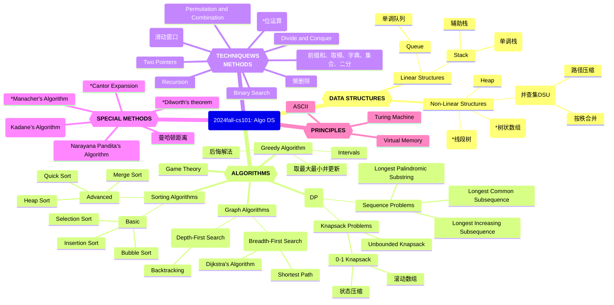

# Week15～16 计算概论知识体系（ADS）

*Updated 2025-12-23 09:53 GMT+8*
 *Compiled by Hongfei Yan (2024 Fall)*


Logs:

> 机考时间：第16周周四上机，2025年12月25日 15:08-17:00, 在6、7号机房
> 笔试时间：周二，2026年1月6日 14:00-16:00。<mark>笔试地点：二教105</mark>。
>
> 课程的总评规划如下：期末机考时长为 1 小时 52 分钟，共包含 6 道编程题。建议同学们力争在机考中取得 AC5 或 AC6 的成绩，以确保获得“优秀”评级；若仅达到 AC0，笔试成绩满分，总评可以 84 分。
>
> 
>
> 机考提示信息：
>
> 2025年12月数算（2025fall-cs201: DS Algo）课程期末上机考试。
> 请独立完成，不能通讯，如：不能使用微信、邮件、QQ等工具。
> 考试期间，请同学只访问OJ，不能访问其他网站，不要查看OJ考试之前自己提交的代码。
> 考试过程中允许可以带10张A4纸大小的cheat sheet，以及空白草稿纸。
> 题目编号前面的大写字母，相应表明是 Easy/Medium/Tough 级别。
> ————-
> 登录别人的账号即视为违纪甚至作弊。把自己的账号密码告诉别人，被别人登录，也视为违纪甚至作弊。如果考前别人用过你的账号，请立即修改密码。
>
> 请把你的昵称改为 25nxxxxx, 后面部分是学号。http://cs101.openjudge.cn/mine
> 有同学昵称24n, 23n, ..., 19n开始也是可以的，学号别错，才能找到你的成绩。
>
> 
>
> 查看：
>
> https://github.com/chenziliang737/2025fall-CS101/blob/main/Book%20my%20Spacecraft.md
>
> https://github.com/GMyhf/2023fall-cs101/blob/main/cheatsheet/review_and_thoughts-202312-HURuicheng.md  
> https://github.com/GMyhf/2023fall-cs101/blob/main/cheatsheet/cheatsheet-20231226-JIANGZixuan.md  
> https://github.com/GMyhf/2023fall-cs101/blob/main/cheatsheet/DailyOption-202312-DENGJinwen.md
>
> 




<center>Knowledge Graph of 2024fall-cs101: Algo DS</center>


# 1 编程练习

## 474D. Flowers

dp, *1700, https://codeforces.com/contest/474/problem/D

查看中文题面，https://www.luogu.com.cn/problem/CF474D

> 如果想查看某个题目的测试数据（往年可以<mark>看到其他人提交的代码</mark>，2024年10月被屏蔽了，2025年9月解封了），替换链接中数字和最后一个字母，例如查看580C 可以访问
> http://codeforces.com/problemset/status/580/problem/C
>
> Codeforces题目是英文，洛谷提供中文。方法是拿到CF题号，如：1749C，直接编辑这个link的相应题号位置，
> https://www.luogu.com.cn/problem/CF1749C


我们已经看过了旱獭为鼹鼠午餐准备的小游戏。现在轮到旱獭的晚餐时间了，众所周知，旱獭喜欢吃花。在每顿晚餐时，他会吃一些红花和一些白花。因此，一顿晚餐可以表示为一串若干花朵序列，其中有些是白花，有些是红花。

但是，为了让晚餐变得美味，有一个规则：旱獭只想以每组 *k* 朵的形式吃白花。

现在，旱獭想知道，他能以多少种方式吃下 <mark>*a* 到 *b* 朵花</mark>。由于方案总数可能非常大，请输出结果对 1000000007（109+7）取模后的值。

**输入格式**

我们已经看过了旱獭为鼹鼠午餐准备的小游戏。现在轮到旱獭的晚餐时间了，众所周知，旱獭喜欢吃花。在每顿晚餐时，他会吃一些红花和一些白花。因此，一顿晚餐可以表示为一串若干花朵序列，其中有些是白花，有些是红花。

但是，为了让晚餐变得美味，有一个规则：旱獭只想以每组 *k* 朵的形式吃白花。

现在，旱獭想知道，他能以多少种方式吃下 *a* 到 *b* 朵花。由于方案总数可能非常大，请输出结果对 1000000007（109+7）取模后的值。

**输出格式**

我们已经看过了旱獭为鼹鼠午餐准备的小游戏。现在轮到旱獭的晚餐时间了，众所周知，旱獭喜欢吃花。在每顿晚餐时，他会吃一些红花和一些白花。因此，一顿晚餐可以表示为一串若干花朵序列，其中有些是白花，有些是红花。

但是，为了让晚餐变得美味，有一个规则：旱獭只想以每组 *k* 朵的形式吃白花。

现在，旱獭想知道，他能以多少种方式吃下 *a* 到 *b* 朵花。由于方案总数可能非常大，请输出结果对 1000000007（109+7）取模后的值。

> We saw the little game Marmot made for Mole's lunch. Now it's Marmot's dinner time and, as we all know, Marmot eats flowers. At every dinner he eats some red and white flowers. Therefore a dinner can be represented as a sequence of several flowers, some of them white and some of them red.
>
> But, for a dinner to be tasty, there is a rule: Marmot wants to eat white flowers only in groups of size *k*.
>
> Now Marmot wonders in how many ways he can eat between *a* and *b* flowers. As the number of ways could be very large, print it modulo $1000000007 (10^9 + 7)$.
>
> **Input**
>
> Input contains several test cases.
>
> The first line contains two integers *t* and *k* ($1 ≤ t, k ≤ 10^5$), where *t* represents the number of test cases.
>
> The next *t* lines contain two integers $a_i$ and $b_i$ ($1 ≤ a_i ≤ b_i ≤ 10^5$), describing the *i*-th test.
>
> **Output**
>
> Print *t* lines to the standard output. The *i*-th line should contain the number of ways in which Marmot can eat between $a_i$ and $b_i$ flowers at dinner modulo $1000000007 (10^9 + 7)$.
>
> Examples
>
> Input
>
> ```
> 3 2
> 1 3
> 2 3
> 4 4
> ```
>
> Output
>
> ```
> 6
> 5
> 5
> ```
>
> Note
>
> - For *K* = 2 and length 1 Marmot can eat (*R*).
> - For *K* = 2 and length 2 Marmot can eat (*RR*) and (*WW*).
> - For *K* = 2 and length 3 Marmot can eat (*RRR*), (*RWW*) and (*WWR*).
> - For *K* = 2 and length 4 Marmot can eat, for example, (*WWWW*) or (*RWWR*), but for example he can't eat (*WWWR*).
>


思路：题目本身就是一个普通的“上楼梯”，但是这里不用前缀和来查询会超时

```python
MAX = 1000000007
t, k = map(int, input().split())
MOD = int(1e9+7)
MAXN = 100001
dp = [0]*MAXN
s = [0]*MAXN
dp[0] = 1
s[0] = 1
for i in range(1, MAXN):
    if i >= k:
        dp[i] = (dp[i-1]+dp[i-k]) % MOD
    else:
        dp[i] = dp[i-1] % MOD
    s[i] = (s[i-1]+dp[i]) % MOD

for _ in range(t):
    a, b = map(int, input().split())
    print((s[b]-s[a-1]+MOD) % MOD)

```

**加 `MOD` 是为了防止减法出现负数，确保模运算结果始终是非负且正确的。**


## M12029: 水淹七军

bfs, dfs, http://cs101.openjudge.cn/practice/12029/

随着最后通牒的递出，C国的总攻也开始了，由于C国在地形上的优势，C国总司令下令采用水攻，剿灭A国最后的有生力量。 
地形图是一个M*N的矩阵，矩阵上每一个点都对应着当前点的高度。C国总司令将选择若干个点进行放水。根据水往低处流的特性，水可以往四个方向的流动，被淹的地方的水面高度便和放水点的高度一样。然而，A国不是一马平川的，所以总会有地方是淹没不到的。你的任务很简单，判断一下A国司令部会不会被淹没掉。 
我们将给你完整的地形图，然后给出A国司令部所在位置，给出C国将在哪几个点进行放水操作。你所需要的，就是给出A国司令部会不会被水淹。

**输入**

第一行：一个整数K，代表数据组数。 
对于每一组数据： 
第1行：符合题目描述的两个整数，M(0 < M <= 200)、N(0 < N <= 200)。 
第2行至M+1行：每行N个数，以空格分开，代表这个矩阵上的各点的高度值H(0 <= H <= 1000)。 
第M+2行：两个整数I(0 < I <= M)、J(0 < J <= N)，代表司令部所在位置。 
第M+3行：一个整数P(0 < P <= M * N)，代表放水点个数。 
第M+4行至M+P+4行：每行两个整数X(0 < X <= M)、Y(0 < Y <= N)，代表放水点。

**输出**

对于每组数据，输出一行，如果被淹则输出Yes，没有则输出No。

样例输入

```
1
5 5
1 1 1 1 1
1 0 0 0 1
1 0 1 0 1
1 0 0 0 1
1 1 1 1 1
3 3
2
1 1
2 2
```

样例输出

```
No
```

提示

样例中左上角的位置是(1, 1),右上角的位置是(1, 5), 右下角的位置是(5, 5)


<mark>根据样例，可以这样理解：如果司令部与周围水等高，不算淹没。</mark>

不用visited的原因，有的点在某些情况下也需要重新遍历。比如之前淹没的高度为h，之后放水的高度H>h，此时就需要重新淹没。即可以不用visited，直接用water_height矩阵（每次洪泛更新），只要扩展点的高度小于当前water_height_value。


bfs实现

```python
from collections import deque
import sys
input = sys.stdin.read

# 判断坐标是否有效
def is_valid(x, y, m, n):
    return 0 <= x < m and 0 <= y < n

# 广度优先搜索模拟水流
def bfs(start_x, start_y, start_height, m, n, h, water_height):
    dx = [-1, 1, 0, 0]
    dy = [0, 0, -1, 1]
    q = deque([(start_x, start_y, start_height)])
    water_height[start_x][start_y] = start_height

    while q:
        x, y, height = q.popleft()
        for i in range(4):
            nx, ny = x + dx[i], y + dy[i]
            if is_valid(nx, ny, m, n) and h[nx][ny] < height:
                if water_height[nx][ny] < height:
                    water_height[nx][ny] = height
                    q.append((nx, ny, height))

# 主函数
def main():
    data = input().split()  # 快速读取所有输入数据
    idx = 0
    k = int(data[idx])
    idx += 1
    results = []

    for _ in range(k):
        m, n = map(int, data[idx:idx + 2])
        idx += 2
        h = []
        for i in range(m):
            h.append(list(map(int, data[idx:idx + n])))
            idx += n
        water_height = [[0] * n for _ in range(m)]

        i, j = map(int, data[idx:idx + 2])
        idx += 2
        i, j = i - 1, j - 1

        p = int(data[idx])
        idx += 1

        for _ in range(p):
            x, y = map(int, data[idx:idx + 2])
            idx += 2
            x, y = x - 1, y - 1

            bfs(x, y, h[x][y], m, n, h, water_height)

        results.append("Yes" if water_height[i][j] > 0 else "No")

    sys.stdout.write("\n".join(results) + "\n")

if __name__ == "__main__":
    main()
```


**思路是对的**，但性能上有一个明显瓶颈：

> 每一个放水点都单独做一次 BFS，在最坏情况下：$P = MN = 4\times10^4$，每次 BFS 扫全图→ TLE

本质优化版，保持你“water_height 矩阵、不用 visited、可重复淹没”的思想，但把复杂度从
$O(P \cdot MN) \rightarrow O(MN \log MN)$

------

核心优化思路

👉 **<mark>多源</mark> + 最大堆 BFS（反向 Dijkstra）**

- 每个放水点是一个“水源”，水位 = 该点高度
- 水只能从 **高 → 低** 流
- 对每个点，只需要知道：
  **它能被淹到的最高水位是多少**

这正是一个：在高度约束下，最大化 water_height 的传播问题

### ✅ 标准 AC 解法（推荐）

```python
import sys
import heapq

input = sys.stdin.read

def main():
    data = list(map(int, input().split()))
    idx = 0
    K = data[idx]
    idx += 1
    out = []

    for _ in range(K):
        M, N = data[idx], data[idx+1]
        idx += 2

        h = []
        for _ in range(M):
            h.append(data[idx:idx+N])
            idx += N

        I, J = data[idx]-1, data[idx+1]-1
        idx += 2

        P = data[idx]
        idx += 1

        water = [[-1]*N for _ in range(M)]
        pq = []  # max-heap: (-water_height, x, y)

        for _ in range(P):
            x, y = data[idx]-1, data[idx+1]-1
            idx += 2
            w = h[x][y]
            if w > water[x][y]:
                water[x][y] = w
                heapq.heappush(pq, (-w, x, y))

        dx = (-1, 1, 0, 0)
        dy = (0, 0, -1, 1)

        flooded = False

        while pq:
            w, x, y = heapq.heappop(pq)
            w = -w

            if w < water[x][y]:
                continue

            if x == I and y == J and w > h[I][J]:
                flooded = True
                break

            for d in range(4):
                nx, ny = x+dx[d], y+dy[d]
                if 0 <= nx < M and 0 <= ny < N:
                    if h[nx][ny] < w and w > water[nx][ny]:
                        water[nx][ny] = w
                        heapq.heappush(pq, (-w, nx, ny))

        out.append("Yes" if flooded else "No")

    print("\n".join(out))


if __name__ == "__main__":
    main()
```

复杂度分析

- 每个点最多被更新几次（堆优化）
- 总复杂度：$O(MN \log MN)$，$200 \times 200$ 轻松过

------

总结

> 这是一个**多源、单调约束、最大值传播**问题
> 用 **最大堆 BFS（反向 Dijkstra）** 是最自然、最稳妥的解法


## M542.01 矩阵

dp, bfs, https://leetcode-cn.com/problems/01-matrix/

给定一个由 `0` 和 `1` 组成的矩阵 `mat` ，请输出一个大小相同的矩阵，其中每一个格子是 `mat` 中对应位置元素到最近的 `0` 的距离。

两个相邻元素间的距离为 `1` 。

 

**示例 1：**


```
输入：mat = [[0,0,0],[0,1,0],[0,0,0]]
输出：[[0,0,0],[0,1,0],[0,0,0]]
```

**示例 2：**


```
输入：mat = [[0,0,0],[0,1,0],[1,1,1]]
输出：[[0,0,0],[0,1,0],[1,2,1]]
```

 

**提示：**

- `m == mat.length`
- `n == mat[i].length`
- `1 <= m, n <= 10^4`
- `1 <= m * n <= 10^4`
- `mat[i][j] is either 0 or 1.`
- `mat` 中至少有一个 `0 `

 

 思路：从所有 0 同时出发做<mark>多源 BFS</mark>，一次性计算出所有 1 到最近 0 的距离。

------

多源 BFS（Multi-source BFS），核心思想：

- 把所有 **0 的位置**作为 BFS 的起点（初始队列）。
- 所有 0 的距离为 0。
- 然后向外一层层扩展，每扩展一层，距离 +1。
- 这样每个格子只被访问一次，**时间复杂度 O(nm)**。

```python
from collections import deque
from typing import List

class Solution:
    def updateMatrix(self, mat: List[List[int]]) -> List[List[int]]:
        n = len(mat)
        m = len(mat[0])
        
        # 初始化结果矩阵，0 的位置为 0，1 的位置设为 -1（表示未访问）
        result = [[-1] * m for _ in range(n)]
        queue = deque()
        
        # 将所有 0 入队，并初始化 result
        for i in range(n):
            for j in range(m):
                if mat[i][j] == 0:
                    result[i][j] = 0
                    queue.append((i, j))
        
        # 四个方向
        directions = [(0, 1), (1, 0), (0, -1), (-1, 0)]
        
        # 多源 BFS
        while queue:
            x, y = queue.popleft()
            for dx, dy in directions:
                nx, ny = x + dx, y + dy
                if 0 <= nx < n and 0 <= ny < m and result[nx][ny] == -1:
                    result[nx][ny] = result[x][y] + 1
                    queue.append((nx, ny))
        
        return result
```


## T02802: 小游戏

bfs, http://cs101.openjudge.cn/practice/02802/ 

一天早上，你起床的时候想：“我编程序这么牛，为什么不能靠这个赚点小钱呢？”因此你决定编写一个小游戏。

游戏在一个分割成w * h个正方格子的矩形板上进行。如图所示，每个正方格子上可以有一张游戏卡片，当然也可以没有。

当下面的情况满足时，我们认为两个游戏卡片之间有一条路径相连：

路径只包含水平或者竖直的直线段。路径不能穿过别的游戏卡片。但是允许路径临时的离开矩形板。下面是一个例子： 


这里在 (1, 3)和 (4, 4)处的游戏卡片是可以相连的。而<mark>在 (2, 3) 和 (3, 4) 处的游戏卡是不相连的</mark>，因为连接他们的每条路径都必须要穿过别的游戏卡片。

你现在要在小游戏里面判断是否存在一条满足题意的路径能连接给定的两个游戏卡片。

**输入**

输入包括多组数据。一个矩形板对应一组数据。每组数据包括的第一行包括两个整数w和h (1 <= w, h <= 75)，分别表示矩形板的宽度和长度。下面的h行，每行包括w个字符，表示矩形板上的游戏卡片分布情况。使用‘X’表示这个地方有一个游戏卡片；使用空格表示这个地方没有游戏卡片。

之后的若干行上每行上包括4个整数x1, y1, x2, y2 (1 <= x1, x2 <= w, 1 <= y1, y2 <= h)。给出两个卡片在矩形板上的位置（注意：矩形板左上角的坐标是(1, 1)）。输入保证这两个游戏卡片所处的位置是不相同的。如果一行上有4个0，表示这组测试数据的结束。

如果一行上给出w = h = 0，那么表示所有的输入结束了。

**输出**

对每一个矩形板，输出一行“Board #n:”，这里n是输入数据的编号。然后对每一组需要测试的游戏卡片输出一行。这一行的开头是“Pair m: ”，这里m是测试卡片的编号（对每个矩形板，编号都从1开始）。接下来，如果可以相连，找到连接这两个卡片的所有路径中包括线段数最少的路径，输出“k segments.”，这里k是找到的最优路径中包括的线段的数目；如果不能相连，输出“impossible.”。

每组数据之后输出一个空行。

样例输入

```
5 4
XXXXX
X   X
XXX X
 XXX 
2 3 5 3
1 3 4 4
2 3 3 4
0 0 0 0
0 0
```

样例输出

```
Board #1:
Pair 1: 4 segments.
Pair 2: 3 segments.
Pair 3: impossible.
```

来源：翻译自Mid-Central European Regional Contest 1999的试题


bfs

这个题目比较麻烦，因为<mark>外圈还可以走</mark>，需要在输入矩阵包一圈。另外，就是行列与我们平时练习<mark>行列刚好反着</mark>。

因为没有走到end之前的线段最短，不能保证总的线段最短。需要穷举队列，找到的最短都append到ans列表，最后min(ans)。

<mark>刘思昊 24工学院。提供了hack数据，会导致很多之前AC的程序WA</mark>。

原因应该是左下那条路先到达终点下面的那个点并且抢占了inq位置，导致后来的左上路线没法进入queue。

使用defaultdict记录seg，以**相同方向到达同一个点是如果seg>=原来的则不值得讨论无需入列，否则还需进一步讨论**

> sample2 input:
>
> ```
> 8 8
> XXXXXXXX
> XX     X
> X XXXX X
> X  XXX X
> XX   X X
> XXXX X X
> XXXX   X
> XXXXXXXX
> 2 2 5 4
> 0 0 0 0
> 0 0
> ```
>
> Sample2 output:
>
> ```
> Board #1:
> Pair 1: 4 segments.
> ```
>
> 
>
> Sample3 input:
>
> ```
> 8 9
> XXXXXXXX
> XX     X
> X XXXX X
> X XXXX X
> X  X X X
> XX   X X
> XXXX X X
> XXXX   X
> XXXXXXXX
> 2 2 5 4
> 0 0 0 0
> 0 0
> ```
>
> Sample3 output:
>
> ```
> Board #1:
> Pair 1: 4 segments.
> ```


bfs

这个题目比较麻烦，因为外圈还可以走，需要在输入矩阵包一圈。另外，就是行列与我们平时练习行列刚好反着。

因为没有走到end之前的线段最短，不能保证总的线段最短。需要穷举队列，找到的最短都append到ans列表，最后min(ans)。

```python
from collections import deque
from collections import defaultdict

def bfs(start, end, grid, h, w):
    queue = deque([start])
    in_queue = defaultdict(lambda: float('inf'))
    dirs = [(0, -1), (-1, 0), (0, 1), (1, 0)]
    min_x = float('inf')
    while queue:
        x, y, d, seg = queue.popleft()

        for i, (dx, dy) in enumerate(dirs):
            nx, ny = x + dx, y + dy

            new_seg = seg if i == d else seg + 1
            if (nx, ny) == end:
                min_x = min(min_x, new_seg)
                continue

            if (0 <= nx < h + 2 and 0 <= ny < w + 2 and new_seg<in_queue[(nx,ny,i)]
                    and grid[nx][ny] != 'X'):
                    in_queue[(nx, ny, i)] = new_seg
                    queue.append((nx, ny, i, new_seg))

    return min_x


board_num = 1
while True:
    w, h = map(int, input().split())
    if w == h == 0:
        break

    grid = [' ' * (w + 2)] + [' ' + input() + ' ' for _ in range(h)] + [' ' * (w + 2)]
    print(f"Board #{board_num}:")
    pair_num = 1
    while True:
        y1, x1, y2, x2 = map(int, input().split())
        if x1 == y1 == x2 == y2 == 0:
            break

        start = (x1, y1, -1, 0)
        end = (x2, y2)

        seg = bfs(start, end, grid, h, w)
        if seg == float('inf'):
            print(f"Pair {pair_num}: impossible.")
        else:
            print(f"Pair {pair_num}: {seg} segments.")
        pair_num += 1

    print()
    board_num += 1
```


其实所有求最短、最长的问题都能用heapq实现，在图搜索中搭配bfs尤其好用。

> 利用heap优先队列的做法，因为每次都取当前队列中线段最小值前进，可以保证最后总的线段最短。这个实际上是Dijkstra。

```python
# 23 工学院 苏王捷
import heapq
from collections import defaultdict

num1 = 1
while True:
    w, h = map(int, input().split())
    if w == 0 and h == 0:
        break
    print(f"Board #{num1}:")
    martix = [[" "] * (w + 2)] + [[" "] + list(input()) + [" "] for _ in range(h)] + [[" "] * (w + 2)]
    dir = [(0, 1), (0, -1), (1, 0), (-1, 0)]
    num2 = 1
    while True:
        x1, y1, x2, y2 = map(int, input().split())
        if x1 == 0 and x2 == 0 and y1 == 0 and y2 == 0:
            break
        queue, flag = [], False
        in_queue = defaultdict(lambda: float("inf"))
        heapq.heappush(queue, (0, x1, y1, -1))
        martix[y2][x2] = " "
        in_queue[(-1, x1, y1)] = 0
        while queue:
            step, x, y, dirs = heapq.heappop(queue)
            if x == x2 and y == y2:
                flag = True
                break
            for i, (dx, dy) in enumerate(dir):
                px, py = x + dx, y + dy
                new_step = step + (dirs != i)
                if 0 <= px <= w + 1 and 0 <= py <= h + 1 and new_step < in_queue[(i, px, py)] and martix[py][px] != "X":
                    in_queue[(i, px, py)] = new_step
                    heapq.heappush(queue, (new_step, px, py, i))
        if flag:
            print(f"Pair {num2}: {step} segments.")
        else:
            print(f"Pair {num2}: impossible.")
        martix[y2][x2] = "X"
        num2 += 1
    print()
    num1 += 1

```


最稳方案：Dijkstra（heapq）

> 上面第二份代码思路，本质上是**标准解**
>  ✔ 不吃 DFS 顺序
>  ✔ 不怕 hack
>  ✔ <mark>不需要枚举答案</mark>

优化后的代码

> ✔ 已通过给出的 **sample2 / sample3** hack数据

### ✅ 标准 AC 解法（推荐）

```python
import heapq
from collections import defaultdict

# 右 左 下 上
DIRS = [(1, 0), (-1, 0), (0, 1), (0, -1)]

def min_segments(grid, w, h, x1, y1, x2, y2):
    pq = []
    dist = defaultdict(lambda: float('inf'))

    # 起点：方向 -1，段数 0
    heapq.heappush(pq, (0, x1, y1, -1))
    dist[(x1, y1, -1)] = 0

    # 终点允许进入
    grid[y2][x2] = ' '

    while pq:
        seg, x, y, d = heapq.heappop(pq)

        if (x, y) == (x2, y2):
            grid[y2][x2] = 'X'
            return seg

        if seg > dist[(x, y, d)]:
            continue

        for i, (dx, dy) in enumerate(DIRS):
            nx, ny = x + dx, y + dy

            # 第一次选方向也算一段
            if d != i:
                nseg = seg + 1
            else:
                nseg = seg

            if 0 <= nx <= w + 1 and 0 <= ny <= h + 1 and grid[ny][nx] != 'X':
                if nseg < dist[(nx, ny, i)]:
                    dist[(nx, ny, i)] = nseg
                    heapq.heappush(pq, (nseg, nx, ny, i))

    grid[y2][x2] = 'X'
    return None


# ================= 主程序 =================

board_id = 1
while True:
    w, h = map(int, input().split())
    if w == h == 0:
        break

    print(f"Board #{board_id}:")

    # 包一圈空白
    grid = (
        [[' '] * (w + 2)] +
        [[' '] + list(input()) + [' '] for _ in range(h)] +
        [[' '] * (w + 2)]
    )

    pair_id = 1
    while True:
        x1, y1, x2, y2 = map(int, input().split())
        if x1 == y1 == x2 == y2 == 0:
            break

        ans = min_segments(grid, w, h, x1, y1, x2, y2)

        if ans is None:
            print(f"Pair {pair_id}: impossible.")
        else:
            print(f"Pair {pair_id}: {ans} segments.")

        pair_id += 1

    print()
    board_id += 1
```

------

总结，必须同时满足 5 点：

1. ✅ 外圈可走（包边）
2. ✅ 状态 = `(x, y, dir)`
3. ✅ 同方向不加段，变方向 +1
4. ✅ **第一次选方向也 +1**
5. ✅ 用 Dijkstra / heap，不能普通 BFS


> 《算法基础。。》上面讲到4.3例题：小游戏，书上给出的是dfs。但是经过同学和助教调试，发现dfs与先沿着哪个邻居出发有关，导致剪枝可能失效。因为可能拿不到一个相对较好的结果，便于比较剪枝。所以最好用bfs完成。
>


## T04129: 变换的迷宫

bfs, http://cs101.openjudge.cn/practice/04129

你现在身处一个R*C 的迷宫中，你的位置用"S" 表示，迷宫的出口用"E" 表示。

迷宫中有一些石头，用"#" 表示，还有一些可以随意走动的区域，用"." 表示。

初始时间为0 时，你站在地图中标记为"S" 的位置上。你每移动一步（向上下左右方向移动）会花费一个单位时间。你必须一直保持移动，不能停留在原地不走。

当前时间是K 的倍数时，迷宫中的石头就会消失，此时你可以走到这些位置上。在其余的时间里，你不能走到石头所在的位置。

求你从初始位置走到迷宫出口最少需要花费多少个单位时间。

如果无法走到出口，则输出"Oop!"。

**输入**

第一行是一个正整数 T，表示有 T 组数据。
每组数据的第一行包含三个用空格分开的正整数，分别为 R、C、K。
接下来的 R 行中，每行包含了 C 个字符，分别可能是 "S"、"E"、"#" 或 "."。
其中，0 < T <= 20，0 < R, C <= 100，2 <= K <= 10。

**输出**

对于每组数据，如果能够走到迷宫的出口，则输出一个正整数，表示最少需要花费的单位时间，否则输出 "Oop!"。

样例输入

```
1
6 6 2
...S..
...#..
.#....
...#..
...#..
..#E#.
```

样例输出

```
7
```


采用**三维 BFS（位置 + 时间取模）**，这是本题在教学与评测中**最稳妥、最不易 WA**的做法。

------

解题核心思想（标准版）

1️⃣ 状态建模

由于 **石头是否可走取决于当前时间是否是 K 的倍数**，而时间是不断增长的，因此：

- 单纯的二维 `visited[x][y]` **不够**
- 到达同一格子，但**时间对 K 的余数不同，后续可行性不同**

正确状态应为：(x, y, t mod K)

------

2️⃣ BFS 合法性判定

从 `(x, y, t)` 走到 `(nx, ny, t+1)`：

- 必须在地图内
- 若 `(t+1) % K == 0` **，石头消失，# 可以走**
- 否则，只能走 `.` / `S` / `E`，⚠️ **S 和 E 都视作空地**

------

### ✅ 标准 AC 解法（推荐）

```python
from collections import deque

def solve():
    T = int(input())
    for _ in range(T):
        R, C, K = map(int, input().split())
        grid = [list(input()) for _ in range(R)]

        for i in range(R):
            for j in range(C):
                if grid[i][j] == 'S':
                    sx, sy = i, j
                elif grid[i][j] == 'E':
                    ex, ey = i, j

        # visited[x][y][t_mod_k]
        visited = [[[False]*K for _ in range(C)] for _ in range(R)]
        q = deque()
        q.append((sx, sy, 0))
        visited[sx][sy][0] = True

        ans = None
        dirs = [(1,0), (-1,0), (0,1), (0,-1)]

        while q:
            x, y, t = q.popleft()
            if (x, y) == (ex, ey):
                ans = t
                break

            nt = t + 1
            mod = nt % K

            for dx, dy in dirs:
                nx, ny = x + dx, y + dy
                if not (0 <= nx < R and 0 <= ny < C):
                    continue
                if visited[nx][ny][mod]:
                    continue

                cell = grid[nx][ny]
                if mod == 0 or cell != '#':  # 石头是否可走
                    visited[nx][ny][mod] = True
                    q.append((nx, ny, nt))

        print(ans if ans is not None else "Oop!")

if __name__ == "__main__":
    solve()
```

------

关键易错点总结（非常重要）

| 易错点                | 正确处理                |
| --------------------- | ----------------------- |
| 只用二维 visited      | ❌ 必须加 `time % K`     |
| 忘记 `S`、`E` 可走    | ❌ 会 WA                 |
| 判断石头用 `time % K` | ❌ 必须是 `(time+1) % K` |
| 到达同一格子直接剪枝  | ❌ 不同余数不可等价      |

------

复杂度

- **时间**：`O(R * C * K)`
- **空间**：`O(R * C * K)`

------

结论

> **本题最稳妥、最通用、最不容易 WA 的标准解法：
> 三维 BFS（x, y, time % K）**


<mark>贪心后悔解法</mark>

思路是无论当前的选项是否最优都接受，然后进行比较，如果选择之后不是最优了，则反悔，舍弃掉这个选项；否则，正式接受。如此往复。

## P4635糖果店（T30204:小P的LLM推理加速）

https://www.luogu.com.cn/problem/P14635

http://cs101.openjudge.cn/practice/30204/


> **P14635 [NOIP2025] 糖果店 / candy（官方数据）**
>
> https://www.luogu.com.cn/problem/P14635
>
> 小 X 开了一家糖果店，售卖 $n$ 种糖果，每种糖果均有无限颗。对于不同种类的糖果，小 X 采用了不同的促销策略。具体地，对于第 $i$ ($1 \le i \le n$) 种糖果，购买第一颗的价格为 $x_i$ 元，第二颗为 $y_i$ 元，第三颗又变回 $x_i$ 元，第四颗则为 $y_i$ 元，以此类推。
>
> 小 R 带了 $m$ 元钱买糖果。小 R 不关心糖果的种类，只想得到数量尽可能多的糖果。你需要帮助小 R 求出，$m$ 元钱能购买的糖果数量的最大值。
>
> **输入格式**
>
> 输入的第一行包含两个正整数 $n, m$，代表糖果的种类数和小 R 的钱数。
>
> 输入的第 $i+1$ ($1 \le i \le n$) 行包含两个正整数 $x_i, y_i$，分别表示购买第 $i$ 种糖果时第奇数颗的价格和第偶数颗的价格。
>
> **输出格式**
>
> 输出一行一个非负整数，表示 $m$ 元钱能购买的糖果数量的最大值。
>
> **样例**
>
> **输入 #1**
>
> ```
> 2 10
> 4 1
> 3 3
> ```
>
> **输出 #1**
>
> ```
> 4
> ```
>
> **输入 #2**
>
> ```
> 3 15
> 1 7
> 2 3
> 3 1
> ```
>
> **输出 #2**
>
> ```
> 8
> ```
>
> 说明/提示
>
> 【样例 1 解释】
>
> 小 R 可以购买 4 颗第一种糖果，共花费 $4 + 1 + 4 + 1 = 10$ 元。
>
> 【样例 2 解释】
>
> 小 R 可以购买 1 颗第一种糖果、1 颗第二种糖果与 6 颗第三种糖果，共花费 $1 + 2 + 12 = 15$ 元。
>
> 【数据范围】
>
> 对于所有测试数据，均有：
>
> - $1 \le n \le 10^5$；
> - $1 \le m \le 10^{18}$；
> - 对于所有 $1 \le i \le n$，均有 $1 \le x_i, y_i \le 10^9$。


【尹显齐 25 物理学院】思路：
取每一种糖果的过程，都可以分解成取或不取 $x_{i}$ + 取 $n$ 个 $x_{i}+y_{i}$ 的过程。
对于所有的 $x_{i}+y_{i}$ ，肯定取其中最小的是最优的。
对于所有的 $x_{i}$ ，取不同个数都对应着不同情况，所以只要枚举取的 $x_{i}$ 的个数就可以，并且对于取 $k$ 个 $x_{i}$ 的情况，一定是取最小的前 $k$ 个最优，所以排序+前缀和即可。

```python
n,m = map(int,input().split())
nums = []
s = []
for i in range(n):
    x,y = map(int,input().split())
    nums.append(x)
    s.append(x+y)
minsum = min(s)
ans = 0
nums.sort()
pre = [0]
for ni in nums:
    pre.append(pre[-1]+ni)
for i,p in enumerate(pre):
    ans = max(ans,((m-p)//minsum)*2+i)
print(ans)
```


## 练习M02431: Expedition

greedy, heap, http://cs101.openjudge.cn/practice/02431


## 练习M1642.可以到达的最远建筑

greedy, heap, https://leetcode.cn/problems/furthest-building-you-can-reach/


# 2 二分查找（Binary Search）

核心思想：当问题求”最小化最大值“或”最大化最小值“时，二分枚举答案。

- 模版：<mark>验证函数 + 二分搜索</mark>
- 关键：讲优化问题转化为判定问题（“能否达到？”）
- 应用：袋子分球、预算分配、资源分配类问题

二分不只是查找，更是“缩小解空间”的通用策略。


> 
>
> 数院胡睿诚：这就是个求最小值的最大值或者最大值的最小值的一个套路。
>
> 求最值转化为判定对不对，判定问题是可以用贪心解决的，然后用二分只用判定log次。


二分查找的难点在于边界条件。推荐参考 Python 标准库 **bisect** 的源码实现（采用左闭右开区间）：
https://github.com/python/cpython/blob/main/Lib/bisect.py


## M08210: 河中跳房子

http://cs101.openjudge.cn/practice/08210

binary search/greedy, http://cs101.openjudge.cn/practice/08210

每年奶牛们都要举办各种特殊版本的跳房子比赛，包括在河里从一个岩石跳到另一个岩石。这项激动人心的活动在一条长长的笔直河道中进行，在起点和离起点L远 (1 ≤ *L*≤ 1,000,000,000) 的终点处均有一个岩石。在起点和终点之间，有*N* (0 ≤ *N* ≤ 50,000) 个岩石，每个岩石与起点的距离分别为$Di (0 < Di < L)$。

在比赛过程中，奶牛轮流从起点出发，尝试到达终点，每一步只能从一个岩石跳到另一个岩石。当然，实力不济的奶牛是没有办法完成目标的。

农夫约翰为他的奶牛们感到自豪并且年年都观看了这项比赛。但随着时间的推移，看着其他农夫的胆小奶牛们在相距很近的岩石之间缓慢前行，他感到非常厌烦。他计划移走一些岩石，使得从起点到终点的过程中，最短的跳跃距离最长。他可以移走除起点和终点外的至多*M* (0 ≤ *M* ≤ *N*) 个岩石。

请帮助约翰确定移走这些岩石后，最长可能的最短跳跃距离是多少？

**输入**

第一行包含三个整数L, N, M，相邻两个整数之间用单个空格隔开。
接下来N行，每行一个整数，表示每个岩石与起点的距离。岩石按与起点距离从近到远给出，且不会有两个岩石出现在同一个位置。

**输出**

一个整数，最长可能的最短跳跃距离。

样例输入

```
25 5 2
2
11
14
17
21
```

样例输出

```
4
```

提示：在移除位于2和14的两个岩石之后，最短跳跃距离为4（从17到21或从21到25）。


> 二分法思路参考：https://blog.csdn.net/gyxx1998/article/details/103831426
>
> **用两分法去推求最长可能的最短跳跃距离**。
> 最初，待求结果的可能范围是[0，L]的全程区间，因此暂定取其半程(L/2)，作为当前的最短跳跃距离，以这个标准进行岩石的筛选。
> **筛选过程**是：
> 先以起点为基点，如果从基点到第1块岩石的距离小于这个最短跳跃距离，则移除第1块岩石，再看接下来那块岩石（原序号是第2块），如果还够不上最小跳跃距离，就继续移除。。。直至找到一块距离基点超过最小跳跃距离的岩石，保留这块岩石，并将它作为新的基点，再重复前面过程，逐一考察和移除在它之后的那些距离不足的岩石，直至找到下一个基点予以保留。。。
> 当这个筛选过程最终结束时，那些幸存下来的基点，彼此之间的距离肯定是大于当前设定的最短跳跃距离的。
> 这个时候要看一下被移除岩石的总数：
>
> - 如果总数>M，则说明被移除的岩石数量太多了（已超过上限值），进而说明当前设定的最小跳跃距离(即L/2)是过大的，其真实值应该是在[0, L/2]之间，故暂定这个区间的中值(L/4)作为接下来的最短跳跃距离，并以其为标准重新开始一次岩石筛选过程。。。
> - <mark>如果总数≤M，则说明被移除的岩石数量并未超过上限值</mark>，进而说明当前设定的最小跳跃距离(即L/2)很可能过小，准确值应该是在[L/2, L]之间，故暂定这个区间的中值(3/4L)作为接下来的最短跳跃距离。

```python
def maxMinJump(L, N, M, rocks):
    # 先将岩石位置排序，并加入起点和终点
    rocks = [0] + rocks + [L]

    left, right = 0, L + 1  # 可能的最小跳跃距离范围。所以二分是在 [left, right) 区间内进行的

    def canAchieve(min_dist):
        """ 判断是否能移除至多 M 个岩石，使最短跳跃距离至少为 min_dist """
        removed = 0  # 记录移除的岩石数量
        prev = 0  # 记录上一个岩石位置（起点）

        for i in range(1, len(rocks)):
            if rocks[i] - rocks[prev] < min_dist:
                removed += 1
                if removed > M:
                    return False  # 不能满足要求
            else:
                prev = i  # 更新上一个岩石位置

        return True  # 可以满足要求

    # 二分查找最长可能的最短跳跃距离
    ans = -1
    while left < right:
        mid = (left + right) // 2  # 取中间偏右值
        if canAchieve(mid):
            ans = mid   # 记录可行的 `mid`
            left = mid + 1  # 继续尝试更大的值
        else:
            right = mid

    return ans


# 读取输入
L, N, M = map(int, input().split())
rocks = [int(input()) for _ in range(N)]

# 计算并输出答案
print(maxMinJump(L, N, M, rocks))
```


## M04135: 月度开销

http://cs101.openjudge.cn/practice/04135

农夫约翰是一个精明的会计师。他意识到自己可能没有足够的钱来维持农场的运转了。他计算出并记录下了接下来 *N* (1 ≤ *N* ≤ 100,000) 天里每天需要的开销。

约翰打算为连续的*M* (1 ≤ *M* ≤ *N*) 个财政周期创建预算案，他把一个财政周期命名为fajo月。每个fajo月包含一天或连续的多天，每天被恰好包含在一个fajo月里。

约翰的目标是合理安排每个fajo月包含的天数，使得开销最多的fajo月的开销尽可能少。

**输入**

第一行包含两个整数N,M，用单个空格隔开。
接下来N行，每行包含一个1到10000之间的整数，按顺序给出接下来N天里每天的开销。

**输出**

一个整数，即最大月度开销的最小值。

样例输入

```
7 5
100
400
300
100
500
101
400
```

样例输出

```
500
```

提示：若约翰将前两天作为一个月，第三、四两天作为一个月，最后三天每天作为一个月，则最大月度开销为500。其他任何分配方案都会比这个值更大。


```python
def minMaxMonthlyExpense(N, M, expenses):
    def can_split(max_expense):
        """ 判断是否能合并至多 M 个花费，使最大花费不超过 max_expense """
        months = 1  # 记录当前使用的月份数
        current_sum = 0 # 当前月的开销
        for cost in expenses:
            if current_sum + cost > max_expense:
                months += 1
                if months > M:
                    return False
                current_sum = cost
            else:
                current_sum += cost
        return True

    # 可能的最小开销范围。所以二分是在 [left, right) 区间内进行的
    left, right = max(expenses), sum(expenses) + 1
    ans = -1
    while left < right: # 二分查找最小的 "最大月度开销"
        mid = (left + right) // 2
        if can_split(mid):
            ans = mid   # 记录可行的 `mid`
            right = mid # 继续尝试更小的值
        else:
            left = mid + 1
    return ans

# 读取输入
N, M = map(int, input().split())
expenses = [int(input()) for _ in range(N)]

# 计算并输出答案
print(minMaxMonthlyExpense(N, M, expenses))
```


## 练习M1760.袋子里最少数目的球

https://leetcode.cn/problems/minimum-limit-of-balls-in-a-bag/


## 练习M02456: Aggressive cows

http://cs101.openjudge.cn/practice/02456


# 3 能申请到$10^{18}$内存吗？（原理）

我的机器2024fall时候是macOS Sonoma 14.6.1，最大可以申请到 276.00 GB（即接近于$2^{38}$）。计算方法如下所述。


## $10^{18}$有多大

要将 $10^{18}$ 字节转换为更常见的存储单位，如GB（吉字节）或TB（太字节），我们需要了解这些单位之间的换算关系。在二进制表示中，这些单位是基于2的幂来定义的，但在十进制表示中，它们通常基于10的幂来定义。

- 1 GB (Gigabyte, 吉字节) = $10^9$ 字节
- 1 TB (Terabyte, 太字节) = $10^{12}$ 字节

因此，$10^{18}$ 字节可以被直接转换为：

- $10^{18} \div 10^9 = 10^9$ GB
- $10^{18} \div 10^{12} = 10^6$ TB

这表示 $10^{18}$ 字节等于 10亿 GB 或者 1百万 TB。


```python
import math
x = math.log2(10**18)
print(x)  # 输出: 59.79470570797252
```


## 判断使用的Python解释器是否64位

要判断你正在使用的Python解释器是32位还是64位，可以通过几种方法来完成。这里我将展示一种简单的方法，即使用Python内置的`platform`模块或`sys`模块来获取相关信息。

**方法 1: 使用 `platform` 模块**

`platform` 模块提供了很多关于平台的信息，包括体系结构（architecture），可以用来区分32位和64位版本。

```python
import platform

print(platform.architecture())
"""
('64bit', 'Mach-O')
"""
```

这个函数会返回一个元组，其中第一个元素表示Python解释器的位数（例如 '32bit' 或 '64bit'）。

**方法 2: 使用 `sys` 模块**

`sys` 模块中的 `maxsize` 属性也可以用来间接判断Python解释器的位数。对于32位Python，`sys.maxsize` 的值通常为 2^31 - 1 (即 2147483647)，而对于64位Python，这个值通常为 2^63 - 1 (即 9223372036854775807)。

> 因为 maxsize 是有符号整数的最大值，所以 32 位时是 2³¹−1，不是 2³²。

```python
import sys

if sys.maxsize > 2**32:
    print("64-bit Python")
else:
    print("32-bit Python")
```

下面我将执行一段代码来演示如何使用这两种方法之一来确定当前Python环境的位数。

```python
import platform
print(platform.architecture()[0])
```

或者使用 `sys` 模块的方法：

```python
import sys
if sys.maxsize > 2**32:
    print("64-bit Python")
else:
    print("32-bit Python")
```


## 测试Python程序可以申请的最大内存量


**python能够申请到的最大内存**

> Python程序能够申请到的最大内存量主要取决于几个因素，包括操作系统、硬件配置以及Python解释器本身的限制。下面是一些关键点：
>
> 1. **操作系统限制**：
>    - 不同的操作系统对进程可以使用的最大内存有不同的默认限制。例如，在Linux上，可以通过`ulimit -a`命令查看当前用户的资源限制，其中包括了最大虚拟内存大小（`virtual memory`）。
>    - 在Windows上，理论上一个32位进程最多可以访问4GB的地址空间，而64位进程则可以访问更大的地址空间。
>
> 2. **硬件限制**：
>    - 物理内存（RAM）的数量直接限制了程序可用的实际物理内存。即使操作系统允许更大的虚拟内存，实际能使用的内存仍然受限于物理内存加上交换空间（swap space）的总量。
>    - 交换空间可以在一定程度上扩展可用内存，但使用大量交换空间会导致性能显著下降。
>
> 3. **Python解释器限制**：
>    - Python本身并没有设置一个固定的内存上限，但它会受到上述因素的影响。
>    - 在32位Python版本中，由于地址空间的限制，通常最大可分配内存为2-4GB左右。
>    - 64位Python版本理论上可以访问更多内存，但是实际可用量依然受限于操作系统的限制和可用的物理及虚拟内存。
>
> 4. **Python内部机制**：
>    - Python对象的内存管理由Python解释器负责，它使用垃圾回收机制来自动释放不再使用的内存。
>    - 对于非常大的数据集，可能需要考虑使用更高效的数据结构或第三方库（如NumPy, Pandas等），这些库针对大数据处理进行了优化，并且支持在内存之外存储数据（例如，使用磁盘上的文件作为后端）。
>
> 5. **增加内存限制的方法**：
>    - 在Linux上，可以通过修改`/etc/security/limits.conf`文件或使用`ulimit`命令来提高单个进程的内存限制。
>    - 对于需要处理特别大数据集的情况，可以考虑使用分布式计算框架（如Apache Spark）、数据库或者其他专门设计用于处理大规模数据的技术。
>
> 总之，Python程序能够申请到的最大内存量不是一个固定值，而是依赖于运行环境的具体条件。


> % ulimit -a
>
> -t: cpu time (seconds)       unlimited
> -f: file size (blocks)       unlimited
> -d: data seg size (kbytes)     unlimited
> -s: stack size (kbytes)       <mark>8176</mark>
> -c: core file size (blocks)     0
> -v: address space (kbytes)     unlimited
> -l: locked-in-memory size (kbytes) unlimited
> -u: processes            10666
> -n: file descriptors        2560


**虚拟地址空间（计算机原理2/3）**

> 三大计算机原理之一，@Book_my_flight_v0.3.md
>
> ​	计算机的基础架构自从 20 世纪 40 年代起就已经形成规范，包括处理器、存储指令和数据的内存、输入和输出设备。它通常叫作冯·诺依曼架构，以约翰·冯·诺依曼（德語：John Von Neumann，1903 年12 月 28 日－1957 年 2 月 8 日）的名字来命名，他在 1946 年发表的论文里描述了这一架构。论文的开头句，用现在的专门术语来说就是，CPU提供算法和控制，而 RAM 和磁盘则是记忆存储，键盘、鼠标和显示器与操作人员交互。其中需要重点理解的是与存储相关的进程的虚拟地址空间。
>
> 虚拟存储器是一个抽象概念，它为每个进程提供了一个假象，好像每个进程都在独占地使用主存。每个进程看到的存储器都是一致的，称之为虚拟地址空间。如图1-15所示的是 Linux 进程的虚拟地址空间（其他 Unix 系统的设计与此类似）。在 Linux 中，最上面的四分之一的地址空间是预留给操作系统中的代码和数据的，这对所有进程都一样。底部的四分之三的地址空间用来存放用户进程定义的代码和数据。请注意，图中的地址是从下往上增大的。
>
> 
>
> 
>
> 图1-15 进程的虚拟地址空间（Process virtual address space）（注：图片来源为 Randal Bryant[8]，2015年3月）
>
> 
>
> ​	每个进程看到的虚拟地址空间由准确定义的区（area）构成，每个区都有专门的功能。简单看下每一个区，从最低的地址开始，逐步向上研究。
>
> - 程序代码和数据（code and data）。代码是从同一固定地址开始，紧接着的是和全局变量相对应的数据区。代码和数据区是由可执行目标文件直接初始化的，示例中就是可执行文件hello。
>
> - 堆（heap）。紧随代码和数据区之后的是运行时堆（Run-time heap）。代码和数据区是在进程一旦开始运行时就被指定了大小的，与此不同，作为调用像 malloc 和 free 这样的 C 标准库函数的结果，堆可以在运行时动态地扩展和收缩。
>
> - 共享库（shared libraries）。在地址空间的中间附近是一块用来存放像标准库和数学库这样共享库的代码和数据的区域。共享库的概念非常强大。
>
> - 栈（stack）。位于用户虚拟地址空间顶部的是用户栈，编译器用它来实现函数调用。和堆一样，用户栈（User stack）在程序执行期间可以动态地扩展和收缩。特别地，每次我们调用一个函数时，栈就会增长。每次我们从函数返回时，栈就会收缩。
>
> - 内核虚拟存储器（kernal virtal memory）。内核是操作系统总是驻留在存储器中的部分。地址空间顶部是为内核预留的。应用程序不允许读写这个区域的内容或者直接调用内核代码定义的函数。
>
> ​	虚拟存储器的运作需要硬件和操作系统软件间的精密复杂的互相合作，包括对处理器生成的每个地址的硬件翻译。基本思想是把一个进程虚拟存储器的内容存储在磁盘上，然后用主存作为磁盘的高速缓存。


> 全局变量和静态变量通常是在数据段（data segment）中分配的，而常量可能会放置在只读数据段（read-only data segment）。栈内存确实用于存储局部变量，但“动态内存分配”通常是与堆相关联的术语。栈上的分配是静态且自动化的，而堆上的分配是动态的，由程序员控制。


要测试Python程序可以申请的最大内存量，你可以编写一个简单的脚本，该脚本会尝试分配越来越多的内存，直到达到系统限制或Python解释器本身的限制。这个过程通常涉及到创建一个越来越大的列表（或其他数据结构），并填充它，直到内存不足。

请注意，这样的测试可能会导致你的系统变得非常慢，甚至可能崩溃，因为它会消耗大量的RAM。因此，在进行这种测试之前，请确保你了解风险，并且最好在受控环境中执行此操作，例如虚拟机或有足够空闲资源的机器上。

```python
import os
import sys
import gc  # 垃圾回收模块


def allocate_memory(chunk_size=1024 * 1024 * 1024, max_attempts=1000):
    """
    尝试分配内存，每次增加chunk_size字节，直到无法分配更多。

    :param chunk_size: 每次尝试分配的内存大小（以字节为单位）
    :param max_attempts: 最大尝试次数
    """
    data = []
    total_allocated = 0
    for i in range(max_attempts):
        try:
            # 尝试分配额外的内存
            data.append(' ' * chunk_size)
            total_allocated += chunk_size
            print(f"Allocated {total_allocated / (1024 * 1024 * 1024):.2f} GB")
        except MemoryError:
            print("Memory allocation failed.")
            break
        finally:
            # 强制垃圾回收
            gc.collect()

    print(f"Total memory allocated: {total_allocated / (1024 * 1024 * 1024):.2f} GB")


# 运行测试
allocate_memory()
```

> 2025/12/16 运行结果，Mac Studio机器
>
> ...
>
> Allocated 375.00 GB
> Allocated 376.00 GB
> Allocated 377.00 GB
>
> Process finished with exit code 137 (interrupted by signal 9:SIGKILL)


> 2024fall 运行结果，mac机器
>
> Allocated 274.00 GB
> Allocated 275.00 GB
> Allocated 276.00 GB
>
> Process finished with exit code 137 (interrupted by signal 9:SIGKILL)


要找出276GB是2的多少次幂，首先需要将276GB转换为字节，因为通常在计算中使用的是二进制单位。1GB等于2^30字节（在二进制表示中）。因此，276GB可以表示为 276 * 2^30 字节。

接下来，我们需要找到一个指数x，使得 2^x 等于 276 * 2^30。这可以通过对数运算来解决：

$ x = \log_2(276 \times 2^{30}) $

$ \log_2(276 \times 2^{30}) = \log_2(276) + \log_2(2^{30}) $

$ \log_2(276) + 30 \approx 8.1073 + 30 = 38.1073 $

这意味着276GB大约等于 $2^{38.1073}$ 字节。由于幂次通常是一个整数，我们可以认为276GB最接近于 $2^{38}$ 字节，但略大于这个值。如果你需要更精确的结果，可以使用科学计算器来获得更准确的对数值。


# 4 最短路径Dijkstra

## 示例E386: 最短距离

https://sunnywhy.com/sfbj/10/4/386

现有一个共n个顶点（代表城市）、m条边（代表道路）的无向图（假设顶点编号为从`0`到`n-1`），每条边有各自的边权，代表两个城市之间的距离。求从s号城市出发到达t号城市的最短距离。

**输入**

第一行四个整数n、m、s、t（$1 \le n \le 100,0 \le m \le \frac{n(n-1)}2, 0 \le s \le n -1, 0 \le t \le n-1$​），分别表示顶点数、边数、起始编号、终点编号；

接下来m行，每行三个整数u、v、w（$0 \le u \le n-1,0 \le v \le n-1, u \ne v, 1 \le w \le 100$），表示一条边的两个端点的编号及边权距离。数据保证不会有重边。

**输出**

输出一个整数，表示最短距离。如果无法到达，那么输出`-1`。

样例1

输入

```
6 6 0 2
0 1 2
0 2 5
0 3 1
2 3 2
1 2 1
4 5 1
```

输出

```
3
```

解释

对应的无向图如下图所示。

共有`3`条从`0`号顶点到`2`号顶点的路径：

1. `0->3->2`：距离为`3`；
2. `0->2`：距离为`5`；
3. `0->1->2`：距离为`3`。

因此最短距离为`3`。


样例2

输入

```
6 6 0 5
0 1 2
0 2 5
0 3 1
2 3 2
1 2 1
4 5 1
```

输出

```
-1
```

解释

和第一个样例相同的图，终点换成了`5`号顶点，显然从`0`号无法到达`5`号。


需要找到从给定的起始城市到目标城市的最短距离。可以使用Dijkstra算法来解决这个问题。Dijkstra算法是一种用于在图中找到最短路径的算法。它从起始节点开始，然后逐步扩展到所有可达的节点，每次选择当前最短的路径进行扩展。

以下是使用 Python 实现 Dijkstra 算法来解决这个问题的示例代码：

```python
import heapq

def dijkstra(n, edges, s, t):
    graph = [[] for _ in range(n)]
    for u, v, w in edges:
        graph[u].append((v, w))
        graph[v].append((u, w))

    pq = [(0, s)]  # (distance, node)
    visited = set()
    distances = [float('inf')] * n
    distances[s] = 0

    while pq:
        dist, node = heapq.heappop(pq)
        if node == t:
            return dist
        if node in visited:
            continue
        visited.add(node)
        for neighbor, weight in graph[node]:
            if neighbor not in visited:
                new_dist = dist + weight
                if new_dist < distances[neighbor]:
                    distances[neighbor] = new_dist
                    heapq.heappush(pq, (new_dist, neighbor))
    return -1

# Read input
n, m, s, t = map(int, input().split())
edges = [list(map(int, input().split())) for _ in range(m)]

# Solve the problem and print the result
result = dijkstra(n, edges, s, t)
print(result)
```

这段代码实现了 Dijkstra 算法来求解从起点到终点的最短路径。首先构建了一个图，然后使用优先队列来选择下一个要探索的节点，并在探索过程中更新最短距离。最后返回从起点到终点的最短距离。

这个版本的Dijkstra算法使用了一个集合`visited`来记录已经访问过的节点，这样可以避免对同一个节点的重复处理。当我们从优先队列中取出一个节点时，如果这个节点已经在`visited`集合中，那么我们就跳过这个节点，处理下一个节点。这样可以提高算法的效率。

此外，这个版本的<mark>Dijkstra算法还在找到目标节点`t`时就立即返回结果，而不是等到遍历完所有节点</mark>。这是因为Dijkstra算法保证了每次从优先队列中取出的节点就是当前距离最短的节点，所以当我们找到目标节点`t`时，就已经找到了从起始节点`s`到`t`的最短路径，无需再继续搜索。

这个版本的Dijkstra算法的时间复杂度仍然是O((V+E)logV)，其中V是顶点数，E是边数。这是因为每个节点最多会被加入到优先队列中一次（当找到一条更短的路径时），并且每条边都会被处理一次（在遍历节点的邻居时）。优先队列的插入和删除操作的时间复杂度都是O(logV)，所以总的时间复杂度是O((V+E)logV)。


Dijkstra 算法是一种经典的图算法，它<mark>综合运用了多种技术，包括邻接表、集合、优先队列（堆）、贪心算法和动态规划的思想</mark>。例题：最短距离，https://sunnywhy.com/sfbj/10/4/386

- 邻接表：Dijkstra 算法通常使用邻接表来表示图的结构，这样可以高效地存储图中的节点和边。
- 集合：在算法中需要跟踪已经访问过的节点，以避免重复访问，这一般使用集合（或哈希集合）来实现。
- 优先队列（堆）：Dijkstra 算法中需要选择下一个要探索的节点，通常使用优先队列（堆）来维护当前候选节点的集合，并确保每次都能快速找到距离起点最近的节点。
- 贪心算法：Dijkstra 算法每次选择距离起点最近的节点作为下一个要探索的节点，这是一种贪心策略，即每次做出局部最优的选择，期望最终能达到全局最优。
- 动态规划：Dijkstra 算法通过不断地更新节点的最短距离来逐步得到从起点到各个节点的最短路径，这是一种动态规划的思想，即将原问题拆解成若干子问题，并以最优子结构来解决。

综合运用这些技术，Dijkstra 算法能够高效地求解单源最短路径问题，对于解决许多实际问题具有重要意义。


第2种写法，没有用set记录访问过的结点。

```python
import heapq

def dijkstra(n, s, t, edges):
    graph = [[] for _ in range(n)]
    for u, v, w in edges:
        graph[u].append((v, w))
        graph[v].append((u, w))

    distance = [float('inf')] * n
    distance[s] = 0

    queue = [(0, s)]
    while queue:
        dist, node = heapq.heappop(queue)
        if dist != distance[node]:
            continue
        for neighbor, weight in graph[node]:
            if distance[node] + weight < distance[neighbor]:
                distance[neighbor] = distance[node] + weight
                heapq.heappush(queue, (distance[neighbor], neighbor))

    return distance[t] if distance[t] != float('inf') else -1

# 接收数据
n, m, s, t = map(int, input().split())
edges = []
for _ in range(m):
    u, v, w = map(int, input().split())
    edges.append((u, v, w))

# 调用函数
min_distance = dijkstra(n, s, t, edges)
print(min_distance)
```

第15行的判断`if dist != distance[node]: continue`的作用是跳过已经找到更短路径的节点。

在Dijkstra算法中，我们使用优先队列（在Python中是heapq）来存储待处理的节点，每次从队列中取出当前距离最短的节点进行处理。但是在处理过程中，有可能会多次将同一个节点加入到队列中，因为我们可能会通过不同的路径到达同一个节点，每次到达时都会将其加入到队列中。

因此，<mark>当我们从队列中取出一个节点时，需要判断这个节点当前的最短距离是否与队列中存储的距离相同</mark>。如果不同，说明这个节点在队列中等待处理的时候，已经有了一条更短的路径，所以我们可以跳过这个节点，处理下一个节点。


## 练习M20106: 走山路

bfs + heap, Dijkstra, http://cs101.openjudge.cn/practice/20106/

某同学在一处山地里，地面起伏很大，他想从一个地方走到另一个地方，并且希望能尽量走平路。
现有一个m*n的地形图，图上是数字代表该位置的高度，"#"代表该位置不可以经过。
该同学每一次只能向上下左右移动，每次移动消耗的体力为移动前后该同学所处高度的差的绝对值。现在给出该同学出发的地点和目的地，需要你求出他最少要消耗多少体力。

**输入**

第一行是m,n,p，m是行数，n是列数，p是测试数据组数
接下来m行是地形图
再接下来n行每行前两个数是出发点坐标（前面是行，后面是列），后面两个数是目的地坐标（前面是行，后面是列）（出发点、目的地可以是任何地方，出发点和目的地如果有一个或两个在"#"处，则将被认为是无法达到目的地）

**输出**

n行，每一行为对应的所需最小体力，若无法达到，则输出"NO"

样例输入

```
4 5 3
0 0 0 0 0
0 1 1 2 3
# 1 0 0 0
0 # 0 0 0
0 0 3 4
1 0 1 4
3 4 3 0
```

样例输出

```
2
3
NO

解释：
第一组：从左上角到右下角，要上1再下来，所需体力为2
第二组：一直往右走，高度从0变为1，再变为2，再变为3，消耗体力为3
第三组：左下角周围都是"#"，不可以经过，因此到不了
```

来源: cs101-2019 张翔宇


Dijkstra 算法的本质是贪心策略，每次扩展的是当前路径代价最小的节点，要维护该贪心性。

```python
import heapq		#260ms

def find_min_cost_path(n, m, mat, queries):
    directions = [(1, 0), (0, 1), (0, -1), (-1, 0)]
    results = []

    for x, y, xx, yy in queries:
        if mat[x][y] == '#' or mat[xx][yy] == '#':
            results.append("NO")
            continue

        dist = {(x, y): 0}  # Distance dictionary to keep track of minimum cost to each node
        heap = [(0, x, y)]  # Priority queue: (cost, row, col)
        found = False

        while heap:
            cost, i, j = heapq.heappop(heap)

            # If the target is reached, record the result and exit the loop
            if (i, j) == (xx, yy):
                results.append(cost)
                found = True
                break

            # Explore all possible moves
            for di, dj in directions:
                ni, nj = i + di, j + dj

                if 0 <= ni < n and 0 <= nj < m and mat[ni][nj] != '#':
                    new_cost = cost + abs(int(mat[ni][nj]) - int(mat[i][j]))

                    # Update the cost if it's lower than any previously recorded cost
                    if (ni, nj) not in dist or new_cost < dist[(ni, nj)]:
                        dist[(ni, nj)] = new_cost
                        heapq.heappush(heap, (new_cost, ni, nj))

        if not found:
            results.append("NO")

    return results

# Input processing
n, m, p = map(int, input().split())
mat = [input().split() for _ in range(n)]
queries = [tuple(map(int, input().split())) for _ in range(p)]

# Solve the problem and output results
answers = find_min_cost_path(n, m, mat, queries)
print("\n".join(map(str, answers)))

```


这里学会了如何优化进行剪枝，heapq是最小堆，只要是非负权值的最短路径问题，就可以使用Dijkstra算法，不断用全局中最小的进行更新，把含权值的最短路径问题给推出来。**贪心思想**：Dijkstra 的核心是贪心扩展——每次优先访问当前代价最小的节点，并通过该节点更新其他节点的代价，从而保证扩展的节点顺序是代价从小到大的。**剪枝的具体实现**

**1. 劣路径的剪枝**：剪枝可以避免无效的路径计算，从而显著减少搜索空间。

```python
if effort > min_effort[x][y]:
    continue
```

​	•	如果当前路径的累计代价 effort 已经大于记录的最优代价 `min_effort[x][y]`，则说明这条路径已经不是最优的，继续扩展它是没有意义的，直接跳过（剪枝）。**剪枝原理**：节点的最优代价是按贪心原则逐步更新的。一旦 `effort > min_effort[x][y]`，说明当前路径已被更优的路径取代。

**2. 路径更新的剪枝**：

```python
if total_effort < min_effort[nx][ny]:
    min_effort[nx][ny] = total_effort
    heapq.heappush(pq, (total_effort, nx, ny))
```

​	•	只有当新路径的累计代价 total_effort 小于已知的代价 min_effort[nx] [ny] 时，才更新邻居节点的代价并加入堆中。
​	•	如果新路径的代价不优于当前最优代价，则直接忽略，避免对无意义的路径进行扩展。

**3. 起点或终点为阻碍的剪枝**：如果起点或终点是不可通行的（#），直接输出 NO，不再进行路径搜索。

```python
if terrain[sx][sy] == '#' or terrain[ex][ey] == '#':
    results.append('NO')
```

使用 heapq 最小堆管理优先级队列，使得插入和取出操作的时间复杂度为 O(log n) ，保证算法整体高效。

```python
import heapq

def min_effort_dijkstra(terrain, m, n, start, end):
    directions = [(-1, 0), (1, 0), (0, -1), (0, 1)]
    pq = [(0, start[0], start[1])]
    min_effort = [[float('inf')] * n for _ in range(m)]
    min_effort[start[0]][start[1]] = 0

    while pq:
        effort, x, y = heapq.heappop(pq)
        if (x, y) == end:
            return effort
        if effort > min_effort[x][y]:
            continue
        for dx, dy in directions:
            nx, ny = x + dx, y + dy

            if 0 <= nx < m and 0 <= ny < n and terrain[nx][ny] != '#':
                next_effort = abs(int(terrain[nx][ny]) - int(terrain[x][y]))
                total_effort = effort + next_effort

                if total_effort < min_effort[nx][ny]:
                    min_effort[nx][ny] = total_effort
                    heapq.heappush(pq, (total_effort, nx, ny))
    return 'NO'

m, n, p = map(int, input().split())
terrain = [input().strip().split() for _ in range(m)]

results = []
for _ in range(p):
    sx, sy, ex, ey = map(int, input().split())
    if terrain[sx][sy] == '#' or terrain[ex][ey] == '#':
        results.append('NO')
    else:
        results.append(min_effort_dijkstra(terrain, m, n, (sx, sy), (ex, ey)))

print("\n".join(map(str, results)))
```


## *Dijkstra正确性证明 

Proof of Dijkstra's Correctness


### 1 详细解释

Dijkstra算法的正确性证明主要基于贪心选择性质和最优子结构性质。下面是对Dijkstra算法正确性的详细解释：

**贪心选择性质**

Dijkstra算法在每一步中总是选择当前已知最短路径的顶点，并且更新其邻居顶点的距离。这种选择方式确保了每次添加到最终解中的顶点都是当前最优的选择。

**最优子结构**

如果从起点 `s` 到某个顶点 `v` 的最短路径是通过顶点 `u`，那么从 `s` 到 `u` 的部分也必须是最短路径。这保证了局部最优解可以组合成全局最优解。


**证明步骤**

1. **定义**：

   - 让 `S`  表示已经确定了最短路径的顶点集合。
   - 让 `V-S`  表示尚未确定最短路径的顶点集合。
   - `d[v]` 表示从起点 `s` 到顶点 `v` 的当前已知最短距离。
   - $\delta(s, v) $ 表示从起点 `s` 到顶点 `v` 的实际最短距离。

2. **初始状态**：

   - 算法开始时，$S = \{s\}$ ，即只包含起点 `s`。
   - 对于所有顶点 $ v \in V-S $，初始化 `d[v]`  为从 `s` 到 `v` 的直接边的权重（如果存在），否则为无穷大。

3. **不变量**：

   - 在每一步执行之前，对于所有 $ u \in S $，有 $ d[u] = \delta(s, u) $。
   - 对于所有 $ v \in V-S $，有 $ d[v] \geq \delta(s, v) $。

4. **迭代过程**：

   - 在每一步中，选择 `V-S` 中 `d[v]` 最小的顶点 `u` 加入 `S`。
   - 更新 `u` 的所有邻居 `v` 的 `d[v]` 值，如果通过 `u` 到达 `v` 的新路径更短，则更新 `d[v]`。

5. **Dijkstra正确性证明，如何理解？**：

   - 假设在某一步骤中，我们选择了 `u` 加入  `S` ，并且 $ u \neq s $。`s`是起点。

   - 由于 `u`  是  `V-S`  中  `d`  值最小的顶点，因此 $ d[u] \leq d[v] $ 对于所有 $ v \in V-S $ 成立。

   - 根据不变量，$ d[u] \geq \delta(s, u) $。

   - 如果 $ d[u] > \delta(s, u) $，则存在一条从 `s` 到 `u` 的更短路径，但这条路径必须经过  `V-S`  中的某个顶点 `w`（因为 `u` 是第一个被加入  S  的顶点）。

   - 由于$ d[w] \geq \delta(s, w) $，且 $ \delta(s, w) + \text{weight}(w, u) \geq \delta(s, u) $，所以 $ d[u] $ 不可能大于 $ \delta(s, u) $。

     > 由于我们假设了存在一条更短的路径，即d[u] > δ(s, u)，那么按照Dijkstra算法更新规则，d[u]应该被更新为d[w] + weight(w, u)或更小的值。这与d[u] > δ(s, u)相矛盾，因为这样会导致d[u]不大于δ(s, u)。

   - 因此，$ d[u] = \delta(s, u) $。

6. **终止条件**：

   - 当所有顶点都被加入  `S`  时，算法结束。
   - 此时，对于所有顶点  `v` ，$ d[v] = \delta(s, v) $。

**结论**

通过上述证明，我们可以得出结论：Dijkstra算法能够正确地找到从单个源点到图中所有其他顶点的最短路径。该算法依赖于非负权重边的假设，如果图中存在负权重边，Dijkstra算法可能会给出错误的结果。在这种情况下，可以使用Bellman-Ford算法来处理。


### 2 进一步解释

Dijkstra 算法的正确性证明基于以下核心逻辑：**每次将一个顶点 `u` 加入已确定最短路径集合 `S` 时，`d[u]` 必然等于从起点 `s` 到该顶点 `u` 的真实最短路径权值 $\delta(s, u)$**。以下是如何理解这一证明步骤的关键点：

------

**1. `u` 的选择保证了它的最小性**

- 在算法中，每次选择 `u` 时，其 `d[u]` 是所有 `V-S` 中 `d` 值最小的。
- 换句话说，<mark>在尚未被处理的顶点中，`u` 是当前最接近起点 `s` 的顶点</mark>。

因此，$d[u] \leq d[v]$ 对于所有 $v \in V-S$。


**2. 不变量：$d[u] \geq \delta(s, u)$**

- 算法的初始化确保了对所有顶点 $v$，`d[v]` 是从起点 `s` 出发到达该顶点的最短路径的一个上界（初始化时，$d[s]=0$，其余顶点 $d[v]=\infty$）。
- 在算法每一步中，通过松弛操作不断缩小 `d[v]` 的值，但始终保持 $d[v] \geq \delta(s, v)$。


**3. 假设反证法：如果 $d[u] > \delta(s, u)$**

如果 $d[u] > \delta(s, u)$，意味着存在更短的路径从 `s` 到达 `u`。设这条路径为 $s \to w \to u$，其中 $w \in V-S$ 是路径上未处理的某个顶点。

**矛盾点分析**

- 根据不变量，$d[w] \geq \delta(s, w)$。

- 由于 `u` 是当前 `V-S` 中 `d` 最小的顶点，因此 $d[u] \leq d[w]$。

- 另一方面，路径 $s \to w \to u$ 的真实距离为 $\delta(s, w) + \text{weight}(w, u)$，而 $\delta(s, w) + \text{weight}(w, u) \geq \delta(s, u)$。

  > 由于我们假设了存在一条更短的路径，即 d[u] > δ(s, u)，那么按照Dijkstra算法更新规则，d[u]应该被更新为d[w] + weight(w, u)或更小的值。这与d[u] > δ(s, u)相矛盾，因为这样会导致d[u]不大于δ(s, u)。

- 综合以上推导可知，$d[u] \geq \delta(s, u)$。

但 $d[u] > \delta(s, u)$ 的假设与上述结论矛盾。


**4. 结论：$d[u] = \delta(s, u)$**

由于不存在更短路径未被考虑，因此 `d[u]` 必等于从 `s` 到 `u` 的真实最短路径权值 $\delta(s, u)$。


### 3 直观理解

可以将 Dijkstra 算法看作“逐步揭露最短路径”的过程：

1. 每次处理一个顶点 `u`，它已经是离 `s` 最近的、尚未处理的顶点。
2. 对于 `u`，我们确认其最短路径值为 $d[u] = \delta(s, u)$，并将其固定在 `S` 中。
3. 此后更新其邻接顶点的 `d` 值，使得其他顶点的潜在路径长度不断逼近真实最短路径。

这种逐步扩展的方式确保了算法的正确性。


# 5 滑动窗口

## M3.无重复字符的最长子串

sliding window, https://leetcode.cn/problems/longest-substring-without-repeating-characters/

给定一个字符串 `s` ，请你找出其中不含有重复字符的 **最长** **子串**的长度。

子字符串 是字符串中连续的非空字符序列。

**示例 1:**

```
输入: s = "abcabcbb"
输出: 3 
解释: 因为无重复字符的最长子串是 "abc"，所以其长度为 3。
```

**示例 2:**

```
输入: s = "bbbbb"
输出: 1
解释: 因为无重复字符的最长子串是 "b"，所以其长度为 1。
```

**示例 3:**

```
输入: s = "pwwkew"
输出: 3
解释: 因为无重复字符的最长子串是 "wke"，所以其长度为 3。
     请注意，你的答案必须是 子串 的长度，"pwke" 是一个子序列，不是子串。
```

 提示：**

- `0 <= s.length <= 5 * 10^4`
- `s` 由英文字母、数字、符号和空格组成


**滑动窗口**

是一个队列，比如例题中的 abcabcbb，进入这个队列（窗口）为 abc 满足题目要求，当再进入 a，队列变成了 abca，这时候不满足要求。所以，我们要移动这个队列！如何移动？我们只要把队列的左边的元素移出就行了，直到满足题目要求！

一直维持这样的队列，找出队列出现最长的长度时候！时间复杂度：O(n)


滑动窗口是一种常用的算法技巧，用于解决数组或字符串中的子数组或子字符串问题。在下面的代码中，滑动窗口的概念体现在通过移动两个指针（起始指针和结束指针）来维护一个当前的无重复子串。

**滑动窗口的基本思想**

1. **初始化**：
   - 维护一个窗口 `[start + 1, i]`，表示当前的无重复子串。
   - 使用一个字典 `char_index` 来记录<mark>每个字符最近一次出现的位置</mark>。

2. **扩展窗口**：
   - 遍历字符串，逐个字符地扩展窗口的右边界 `i`。

3. **收缩窗口**：
   - 如果当前字符 `c` 在字典中且其上次出现的位置在当前窗口内，则需要收缩窗口的左边界 `start`，使其不包含重复字符。


```python
class Solution:
    def lengthOfLongestSubstring(self, s: str) -> int:
        # 初始化变量
        start = -1  # 当前无重复子串的起始位置的前一个位置
        max_length = 0  # 最长无重复子串的长度
        char_index = {}  # 字典，记录每个字符最近一次出现的位置
        
        # 遍历字符串
        for i, char in enumerate(s):
            # 如果字符在字典中且上次出现的位置大于当前无重复子串的起始位置
            if char in char_index and char_index[char] > start:
                # 更新起始位置为该字符上次出现的位置
                start = char_index[char]
            
            # 更新字典中字符的位置
            char_index[char] = i
            
            # 计算当前无重复子串的长度，并更新最大长度
            current_length = i - start
            max_length = max(max_length, current_length)
        
        return max_length
```

> **代码解读**
>
> - `k`：记录当前无重复子串的起始位置的前一个位置，初始值为 -1。
> - `res`：记录最长无重复子串的长度，初始值为 0。
> - `c_dict`：一个字典，用于记录每个字符最近一次出现的位置。
>
> **处理字符**
>
> ```python
>             if c in c_dict and c_dict[c] > k:  # 字符c在字典中 且 上次出现的下标大于当前长度的起始下标
>                 k = c_dict[c]
>                 c_dict[c] = i
>             else:
>                 c_dict[c] = i
>                 res = max(res, i - k)
> ```
>
> - 条件判断：
>   - `if c in c_dict and c_dict[c] > k`：检查当前字符 `c` 是否在字典中，并且该字符上次出现的位置是否大于当前无重复子串的起始位置的前一个位置 `k`。
>   - 如果条件成立，说明当前字符 `c` 在之前的子串中已经出现过，且该位置在当前无重复子串的范围内，因此需要更新 `k` 为该字符上次出现的位置。
>   - `k = c_dict[c]`：更新 `k` 为字符 `c` 上次出现的位置。
>   - `c_dict[c] = i`：更新字典中字符 `c` 的位置为当前索引 `i`。
> - 否则：
>   - `c_dict[c] = i`：更新字典中字符 `c` 的位置为当前索引 `i`。
>   - `res = max(res, i - k)`：计算当前无重复子串的长度 `i - k`，并更新 `res` 为当前最大值。


# 6 并查集dsu

并查集优化，下面几个例子只用到了路径压缩（Path Compression），没有涉及哪棵树被连接到另一棵树上。

这可以通过两种方式实现：<mark>第一种是按秩合并（Union by Rank），它将树的高度作为考虑因素；第二种是按大小合并（Union by Size），它将树的大小作为考虑因素来决定如何将一棵树连接到另一棵树。</mark>

在 2025128_ADS_week08-09_recursion_backtracking.md 的5.2部分有讲到。

> **5.2.2 Union by Rank**
>
> 首先，我们需要一个新的整数数组，称为 **rank[]**。该数组的大小与父数组 **Parent[]** 相同。如果 **i** 是某个集合的代表，则 **rank[i]** 表示代表该集合的树的高度。
>
> 现在回想一下，在 **Union（合并）** 操作中，将哪一棵树移到另一棵树下并不重要。我们现在希望做的是**最小化结果树的高度**。如果我们正在合并两棵树（或集合），我们称它们为 **left** 和 **right**，那么这完全取决于 **left 的秩** 和 **right 的秩**。
>
> - 如果 **left 的秩** 小于 **right 的秩**，那么最好将 **left 移到 right 下方**，因为这样不会改变 **right 的秩**（而将 **right 移到 left 下方** 会增加高度）。同样地，如果 **right 的秩** 小于 **left 的秩**，那么我们应该将 **right 移到 left 下方**。
>
>   
>
> **5.2.4 Union by Size**
>
> 同样，我们需要一个新的整数数组，称为 **size[]**。该数组的大小与父数组 **Parent[]** 相同。如果 **i** 是某个集合的代表，则 **size[i]** 表示代表该集合的树中元素的数量。
>
> 现在我们要合并两棵树（或集合），我们称它们为 **left** 和 **right**，在这种情况下，这完全取决于 **left 的大小** 和 **right 的大小**（即树或集合中的元素数量）。
>
> - 如果 **left 的大小** 小于 **right 的大小**，那么最好将 **left 移到 right 下方**，并将 **right 的大小** 增加 **left 的大小**。同样地，如果 **right 的大小** 小于 **left 的大小**，那么我们应该将 **right 移到 left 下方**，并将 **left 的大小** 增加 **right 的大小**。
> - 如果两者的大小相等，那么无论哪棵树移到另一棵树下都没有关系。


## M360 学校的班级个数（1）

https://sunnywhy.com/sfbj/9/6/360

现有一个学校，学校中有若干个班级，每个班级中有若干个学生，每个学生只会存在于一个班级中。如果学生`A`和学生`B`处于一个班级，学生`B`和学生`C`处于一个班级，那么我们称学生`A`和学生`C`也处于一个班级。

现已知学校中共 n 个学生（编号为从`1`到`n`），并给出 m 组学生关系（指定两个学生处于一个班级），问总共有多少个班级。

**输入**

第一行两个整数 $m、n (1 \le n \le 100, 1 \le m \le 100)$，分别表示学生个数、学生关系个数；

接下来 m 行，每行两个整数 a 和 b $ (1 \le a \le n, 1 \le b \le n, a \ne b)$，表示编号为`a`的学生和编号为`b`的学生处于一个班级。

**输出**

输出一个整数，表示班级个数。

样例1

输入

```
5 3
4 2
1 3
2 5
```

输出

```
2
```

解释

编号`2`、`4`、`5`的学生在同一个班级，编号`1`、`3`的学生在同一个班级，因此共有两个班级。


To solve this problem, you can use the concept of disjoint sets (also known as union-find). Each student is initially in their own set (or class). When a relationship between two students is given, you unite their sets. The number of disjoint sets at the end will be the number of classes.

Here is a step-by-step plan:

1. Initialize an array `parent` of size `n+1` where `parent[i]` is initially `i`. This means each student is in their own class.
2. For each student relationship, unite their sets using the union operation.
3. Count the number of unique parents. This will be the number of classes.

Here is the Python code that implements this plan:

```python
def find(x):
    if parent[x] != x: # 如果不是根结点，继续循环
        parent[x] = find(parent[x])
    return parent[x]

def union(x, y):
    parent[find(x)] = find(y)

n, m = map(int, input().split())
parent = list(range(n + 1))	# parent[i] == i，则说明元素i是该集合的根结点

for _ in range(m):
    a, b = map(int, input().split())
    union(a, b)

classes = set(find(x) for x in range(1, n + 1))
print(len(classes))
```

This code reads the number of students and relationships from the input, initializes each student to be in their own class, unites the classes of each pair of students that have a relationship, and then counts and prints the number of unique classes.


## M361 学校的班级人数（2）

https://sunnywhy.com/sfbj/9/6/361

现有一个学校，学校中有若干个班级，每个班级中有若干个学生，每个学生只会存在于一个班级中。如果学生`A`和学生`B`处于一个班级，学生`B`和学生`C`处于一个班级，那么我们称学生`A`和学生`C`也处于一个班级。

现已知学校中共 n 个学生（编号为从`1`到`n`），并给出 m 组学生关系（指定两个学生处于一个班级），问总共有多少个班级，并按降序给出每个班级的人数。

**输入**

第一行两个整数 $m、n (1 \le n \le 100, 1 \le m \le 100)$，分别表示学生个数、学生关系个数；

接下来 m 行，每行两个整数 a 和 b $ (1 \le a \le n, 1 \le b \le n, a \ne b)$，表示编号为`a`的学生和编号为`b`的学生处于一个班级。

**输出**

第一行输出一个整数，表示班级个数；

第二行若干个整数，按降序给出每个班级的人数。整数之间用空格隔开，行末不允许有多余的空格。

样例1

输入

```
5 3
4 2
1 3
2 5
```

输出

```
2
3 2
```

解释

编号`2`、`4`、`5`的学生在同一个班级，编号`1`、`3`的学生在同一个班级，因此共有两个班级，人数分别是`3`和`2`。


To solve this problem, you can use the concept of disjoint sets (also known as union-find). Each student is initially in their own set (or class). When a relationship between two students is given, you unite their sets. The number of disjoint sets at the end will be the number of classes. You can also maintain a count of the number of students in each class.

Here is a step-by-step plan:

1. Initialize an array `parent` of size `n+1` where `parent[i]` is initially `i`. This means each student is in their own class.
2. Initialize an array `size` of size `n+1` where `size[i]` is initially `1`. This means each class initially has one student.
3. For each student relationship, unite their sets using the union operation and update the size of the new set.
4. Count the number of unique parents. This will be the number of classes.
5. Print the sizes of the classes in descending order.

Here is the Python code that implements this plan:

```python
def find(x):
    if parent[x] != x:
        parent[x] = find(parent[x])
    return parent[x]

def union(x, y):
    root_x = find(x)
    root_y = find(y)
    if root_x != root_y:
        parent[root_x] = root_y
        size[root_y] += size[root_x]

n, m = map(int, input().split())
parent = list(range(n + 1))
size = [1] * (n + 1)

for _ in range(m):
    a, b = map(int, input().split())
    union(a, b)

#classes = [size[find(x)] for x in range(1, n + 1) if x == parent[x]]
classes = [size[x] for x in range(1, n + 1) if x == parent[x]]
print(len(classes))
print(' '.join(map(str, sorted(classes, reverse=True))))
```

This code reads the number of students and relationships from the input, initializes each student to be in their own class, unites the classes of each pair of students that have a relationship, counts and prints the number of unique classes, and prints the sizes of the classes in descending order.


## M362 是否相同班级

https://sunnywhy.com/sfbj/9/6/362

现有一个学校，学校中有若干个班级，每个班级中有若干个学生，每个学生只会存在于一个班级中。如果学生`A`和学生`B`处于一个班级，学生`B`和学生`C`处于一个班级，那么我们称学生`A`和学生`C`也处于一个班级。

现已知学校中共 n 个学生（编号为从`1`到`n`），并给出 m 组学生关系（指定两个学生处于一个班级）。然后给出 k 个查询，每个查询询问两个学生是否在同一个班级。

**输入**

第一行两个整数 $n、m (1 \le n \le 10^5, 1 \le m \le 10^5)$，分别表示学生个数、学生关系个数；

接下来 m 行，每行两个整数 a 和 b $ (1 \le a \le n, 1 \le b \le n, a \ne b)$，表示编号为`a`的学生和编号为`b`的学生处于一个班级。

然后一个整数 $k (1 \le k \le 10^3)$，表示查询个数；

接下来 k 行，每行两个整数 a 和 b $ (1 \le a \le n, 1 \le b \le n)$，表示询问编号为`a`的学生和编号为`b`的学生是否在同一个班级。

**输出**

每个查询输出一行，如果在同一个班级，那么输出`Yes`，否则输出`No`。

样例1

输入

```
5 3
4 2
1 3
2 5
2
4 5
1 2
```

输出

```
Yes
No
```

解释

编号`2`、`4`、`5`的学生在同一个班级，编号`1`、`3`的学生在同一个班级，因此编号`4`和`5`的学生在同一个班级，编号`1`和`2`的学生不在同一个班级。


To solve this problem, you can use the concept of disjoint sets (also known as union-find). Each student is initially in their own set (or class). When a relationship between two students is given, you unite their sets. For each query, you check if the two students are in the same set.

Here is a step-by-step plan:

1. Initialize an array `parent` of size `n+1` where `parent[i]` is initially `i`. This means each student is in their own class.
2. For each student relationship, unite their sets using the union operation.
3. For each query, check if the two students are in the same set using the find operation.

Here is the Python code that implements this plan:

```python
def find(x):
    if parent[x] != x:
        parent[x] = find(parent[x])
    return parent[x]

def union(x, y):
    parent[find(x)] = find(y)

n, m = map(int, input().split())
parent = list(range(n + 1))

for _ in range(m):
    a, b = map(int, input().split())
    union(a, b)

k = int(input())
for _ in range(k):
    a, b = map(int, input().split())
    if find(a) == find(b):
        print('Yes')
    else:
        print('No')
```

This code reads the number of students and relationships from the input, initializes each student to be in their own class, unites the classes of each pair of students that have a relationship, and then for each query, checks and prints whether the two students are in the same class.


## M363 迷宫连通性

https://sunnywhy.com/sfbj/9/6/363

现有一个迷宫，迷宫中有 n 个房间（编号为从`1`到`n`），房间与房间之间可能连通。如果房间`A`和房间`B`连通，房间`B`和房间`C`连通，那么我们称房间`A`和房间`C`也连通。给定 m 组连通关系（指定两个房间连通），问迷宫中的所有房间是否连通。

**输入**

第一行两个整数$n、m (1 \le n \le 100, 1 \le m \le 100)$，分别表示房间个数、连通关系个数；

接下来行，每行两个整数 a 和 b $ (1 \le a \le n, 1 \le b \le n)$，表示编号为`a`的房间和编号为`b`的房间是连通的。

**输出**

如果所有房间连通，那么输出`Yes`，否则输出`No`。

样例1

输入

```
5 4
4 2
1 3
2 5
1 5
```

输出

```
Yes
```

解释

所有房间都连通，因此输出`Yes`。

样例2

输入

```
5 3
4 2
1 3
2 5
```

输出

```
No
```

解释

编号`2`、`4`、`5`的房间互相连通，编号`1`、`3`的房间互相连通，因此没有全部互相连通，输出`No`。


To solve this problem, you can use the concept of disjoint sets (also known as union-find). Each room is initially in its own set. When a connection between two rooms is given, you unite their sets. If at the end there is only one set, then all rooms are connected.

Here is a step-by-step plan:

1. Initialize an array `parent` of size `n+1` where `parent[i]` is initially `i`. This means each room is in its own set.
2. For each connection, unite their sets using the union operation.
3. Check if all rooms are in the same set.

Here is the Python code that implements this plan:

```python
def find(x):
    if parent[x] != x:
        parent[x] = find(parent[x])
    return parent[x]

def union(x, y):
    parent[find(x)] = find(y)

n, m = map(int, input().split())
parent = list(range(n + 1))

for _ in range(m):
    a, b = map(int, input().split())
    union(a, b)

sets = set(find(x) for x in range(1, n + 1))
if len(sets) == 1:
    print('Yes')
else:
    print('No')
```

This code reads the number of rooms and connections from the input, initializes each room to be in its own set, unites the sets of each pair of rooms that have a connection, and then checks and prints whether all rooms are in the same set.


这个题目挺像排队的，大家练习下。

## 练习M1202.交换字符串中的元素

dsu, https://leetcode.cn/problems/smallest-string-with-swaps/


# 7 辅助栈、懒删除

## M22067: 快速堆猪

辅助栈, http://cs101.openjudge.cn/practice/22067/

小明有很多猪，他喜欢玩叠猪游戏，就是将猪一头头叠起来。猪叠上去后，还可以把顶上的猪拿下来。小明知道每头猪的重量，而且他还随时想知道叠在那里的猪最轻的是多少斤。

**输入**

有三种输入

1) push n
   n是整数(0<=0 <=20000)，表示叠上一头重量是n斤的新猪
2) pop
   表示将猪堆顶的猪赶走。如果猪堆没猪，就啥也不干
3) min
   表示问现在猪堆里最轻的猪多重。如果猪堆没猪，就啥也不干

输入总数不超过100000条

**输出**

对每个min输入，输出答案。如果猪堆没猪，就啥也不干

样例输入

```
pop
min
push 5
push 2
push 3
min
push 4
min
```

样例输出

```
2
2
```

来源: Guo wei


用辅助栈：用一个单调栈维护最小值，再用另外一个栈维护其余的值。

每次push时，在辅助栈中加入当前最轻的猪的体重，pop时也同步pop，这样栈顶始终是当前猪堆中最轻的体重，查询时直接输出即可。

 

```python
pig, pigmin = [], []
while True:
    try:
        *line, = input().split()
        if "pop" in line:
            if len(pig) == 0:
                continue

            val = pig.pop()
            if len(pigmin) > 0 and val == pigmin[-1]:
                pigmin.pop()
        elif "push" in line:
            val = int(line[1])
            pig.append(val)
            if len(pigmin) == 0 or val <= pigmin[-1]:
                pigmin.append(val)
        elif "min" in line:
            if len(pig) == 0:
                continue
            else:
                print(pigmin[-1])
    except EOFError:
        break
```


字典标记，懒删除

```python
import heapq
from collections import defaultdict

out = defaultdict(int)
pigs_heap = []
pigs_stack = []

while True:
    try:
        s = input()
    except EOFError:
        break

    if s == "pop":
        if pigs_stack:
            out[pigs_stack.pop()] += 1
    elif s == "min":
        if pigs_stack:
            while True:
                x = heapq.heappop(pigs_heap)
                if not out[x]:
                    heapq.heappush(pigs_heap, x)
                    print(x)
                    break
                out[x] -= 1
    else:
        y = int(s.split()[1])
        pigs_stack.append(y)
        heapq.heappush(pigs_heap, y)
```


集合标记，懒删除。如果有重复项就麻烦了，可能刚好赶上题目数据友好。

```python
import heapq

class PigStack:
    def __init__(self):
        self.stack = []
        self.min_heap = []
        self.popped = set()

    def push(self, weight):
        self.stack.append(weight)
        heapq.heappush(self.min_heap, weight)

    def pop(self):
        if self.stack:
            weight = self.stack.pop()
            self.popped.add(weight)

    def min(self):
        while self.min_heap and self.min_heap[0] in self.popped:
            self.popped.remove(heapq.heappop(self.min_heap))
        if self.min_heap:
            return self.min_heap[0]
        else:
            return None

pig_stack = PigStack()

while True:
    try:
        command = input().split()
        if command[0] == 'push':
            pig_stack.push(int(command[1]))
        elif command[0] == 'pop':
            pig_stack.pop()
        elif command[0] == 'min':
            min_weight = pig_stack.min()
            if min_weight is not None:
                print(min_weight)
    except EOFError:
        break
```


## T27384:候选人追踪

懒删除，http://cs101.openjudge.cn/practice/27384/

超大型偶像团体HIHO314159总选举刚刚结束了。制作人小Hi正在复盘分析投票过程。 

小Hi获得了N条投票记录，每条记录都包含一个时间戳Ti以及候选人编号Ci，代表有一位粉丝在Ti时刻投了Ci一票。 

给定一个包含K名候选人集合S={S1, S2, ... SK}，小Hi想知道从投票开始(0时刻)，到最后一张票投出的时刻(max{Ti})，期间有多少时间得票最多的前K名候选人恰好是S中的K名候选人。

注意这里对前K名的要求是"严格"的，换句话说，S中的每一名候选人得票都要大于任何一名S之外的候选人。S集合内名次先后不作要求。 

注：HIHO314159这个团体有314159名团员，编号是1~314159。

**输入**

第一行包含两个整数N和K。

第二行包含2N个整数：T1, C1, T2, C2, ... TN, CN。 

第三行包含K个整数：S1, S2, ... SK。 

对于30%的数据，1 ≤ N, K ≤ 100 

对于60%的数据，1 ≤ N, K ≤ 1000 

对于100%的数据, 1 ≤ N, K ≤ 314159 1 ≤ Ti ≤ 1000000 1 ≤ Ci, SK ≤ 314159

**输出**

一个整数，表示前K名恰好是S一共持续了多少时间。

样例输入

```
10 2  
3 1 4 1 5 1 4 3 6 5 8 3 7 5 8 5 9 1 10 5  
1 5
```

样例输出

```
3
```

来源

HC


双堆+懒删除

```python
import sys
import heapq

# 增加递归深度，虽然本解法主要依靠迭代
sys.setrecursionlimit(5000)

def solve():
    # 使用 sys.stdin.read 快速读取所有输入
    input_data = sys.stdin.read().split()
    
    if not input_data:
        return

    iterator = iter(input_data)
    
    try:
        N = int(next(iterator))
        K = int(next(iterator))
    except StopIteration:
        return

    # 读取投票记录 (2*N 个整数)
    votes = []
    for _ in range(N):
        t = int(next(iterator))
        c = int(next(iterator))
        votes.append((t, c))
    
    # 读取集合 S (K 个整数)
    target_s = set()
    for _ in range(K):
        target_s.add(int(next(iterator)))

    # 关键步骤：按时间戳排序
    votes.sort(key=lambda x: x[0])

    # 题目给定总人数
    TOTAL_MEMBERS = 314159
    max_id = TOTAL_MEMBERS + 1
    
    vote_counts = [0] * max_id
    
    # 两个堆：
    # min_heap_s: 维护 S 集合内的票数 (票数, ID)，堆顶是最小值
    # max_heap_other: 维护 S 集合外的票数 (-票数, ID)，堆顶是最大值
    min_heap_s = []
    max_heap_other = []

    # 初始化 S 集合堆，所有人初始票数为 0
    for cid in target_s:
        heapq.heappush(min_heap_s, (0, cid))
    
    # 【特判核心逻辑】
    # 如果 K == 314159，说明所有人都在 S 里，S 之外为空集。空集的最大值设为 -1。
    # 否则，S 之外至少有一人，初始票数为 0，最大值底线为 0。
    default_max_other = -1 if K == TOTAL_MEMBERS else 0

    # 获取 S 中最小票数（带懒删除）
    def get_min_s_votes():
        while min_heap_s:
            cnt, cid = min_heap_s[0]
            # 检查堆顶元素是否过期
            if vote_counts[cid] == cnt:
                return cnt
            heapq.heappop(min_heap_s)
        return 0

    # 获取 S 之外最大票数（带懒删除）
    def get_max_other_votes():
        while max_heap_other:
            neg_cnt, cid = max_heap_other[0]
            if vote_counts[cid] == -neg_cnt:
                return -neg_cnt
            heapq.heappop(max_heap_other)
        # 如果堆空了，返回设定好的默认值 (-1 或 0)
        return default_max_other

    total_valid_time = 0
    last_time = 0
    idx = 0
    
    # 遍历所有投票事件
    while idx < N:
        curr_time = votes[idx][0]
        
        # 1. 结算上一段时间段
        if curr_time > last_time:
            min_s = get_min_s_votes()
            max_other = get_max_other_votes()
            
            # 核心条件：S 最小值 > Other 最大值
            if min_s > max_other:
                total_valid_time += (curr_time - last_time)
        
        # 2. 处理当前时刻所有的票数变动
        while idx < N and votes[idx][0] == curr_time:
            _, cid = votes[idx]
            
            vote_counts[cid] += 1
            new_cnt = vote_counts[cid]
            
            if cid in target_s:
                heapq.heappush(min_heap_s, (new_cnt, cid))
            else:
                # Python 默认小顶堆，存负数来实现大顶堆
                heapq.heappush(max_heap_other, (-new_cnt, cid))
            
            idx += 1
        
        last_time = curr_time

    # 注意：题目要求统计到 max{Ti}，循环结束后即到达最后时刻，不需要处理后续时间
    print(total_valid_time)

if __name__ == '__main__':
    solve()
```

**算法详细解释**

这道题目本质上是一个**时间轴模拟（Simulate）**问题，结合了**数据结构**的优化。

**1. 核心思路**

我们需要在时间轴上从 $0$ 走到 $max(T_i)$。在任意两个投票事件之间，票数是保持不变的。因此，我们只需要处理每个投票发生的时间点。
算法流程如下：

1.  **排序**：将所有投票记录按时间 $T$ 排序。
2.  **遍历**：按时间顺序处理投票。对于每一个新的时间点 $T_{now}$，我们计算从上一个时间点 $T_{last}$ 到 $T_{now}$ 的时间差。
3.  **判断状态**：如果在这段空隙时间内，满足“S集合所有人的票数都严格大于非S集合所有人的票数”，则将时间差累加到总结果中。
4.  **更新数据**：处理 $T_{now}$ 时刻发生的所有投票，更新候选人的票数。

**2. 条件判断的优化**

题目要求的条件是：**S 中票数最少的人 > S 之外票数最多的人**。
如果每次都遍历所有候选人来找最大最小值，复杂度是 $O(N \times K)$ 或 $O(N \times \text{总人数})$，这在 $N=300,000$ 时会超时。

我们需要高效地获取两个值：

1.  $Min\_S$：集合 $S$ 内候选人的最低票数。
2.  $Max\_Other$：集合 $S$ 外候选人的最高票数。

**解决方案：使用两个堆（优先队列）**

*   **Min-Heap (min_heap_s)**: 存储集合 $S$ 中所有人的 `(票数, ID)`。堆顶即为 $Min\_S$。
*   **Max-Heap (max_heap_other)**: 存储集合 $S$ 之外所有**得过票**的人的 `(票数, ID)`。堆顶即为 $Max\_Other$。如果堆为空，则 $Max\_Other = 0$（因为还有无数没得票的人）。

**3. 懒删除（Lazy Deletion）技巧**

当一个候选人的票数增加时（例如从 2 票变为 3 票），他在堆中原来的记录 `(2, ID)` 就失效了。
由于 Python 的 `heapq` 不支持直接修改堆中间的元素，我们采用**懒删除**策略：

*   更新时，直接将新的记录 `(3, ID)` 压入堆中。
*   取值时（查看堆顶），检查堆顶元素的票数是否等于该 ID 当前的实际票数（在 `vote_counts` 数组中查询）。
    *   如果不等，说明这是个旧记录，直接弹出（`heappop`）并丢弃。
    *   如果相等，说明是有效记录，直接使用。

**4. 复杂度分析**

*   **时间复杂度**：
    *   排序：$O(N \log N)$。
    *   主循环：遍历 $N$ 次。每次投票操作会进行堆的 `push`，每次状态查询可能会进行多次 `pop`（由于懒删除）。但每个元素最多进堆一次、出堆一次。因此总的堆操作次数与 $N$ 成正比。
    *   总复杂度：$O(N \log N)$。对于 $N=300,000$，这完全可以在 1 秒内完成。
*   **空间复杂度**：需要存储所有候选人的票数和堆，约为 $O(N + \text{候选人ID范围})$，内存限制 256MB 足够使用。

**5. 注意事项**

*   **输入读取**：Python 的 `input()` 在数据量巨大时较慢，推荐使用 `sys.stdin.read().split()` 一次性读取。
*   **同一时刻多票**：题目中可能有多个记录发生在同一时刻 $T$。必须先处理完该时刻所有的票数变化，再去计算随后的时间段，或者先计算上一段时间段，再处理当前时刻的所有票。代码中使用的是“先结算上一段 $last \to curr$，再更新当前 $curr$”的逻辑。
*   **初始状态**：S 集合初始票数全为 0，S 之外初始全为 0。初始时刻 $Min\_S = 0, Max\_Other = 0$，条件 $0 > 0$ 不成立。


# 8 DFS + 剪枝

## T01661: Help Jimmy

dfs, dp, http://cs101.openjudge.cn/practice/01661

"Help Jimmy" 是在下图所示的场景上完成的游戏：

场景中包括多个长度和高度各不相同的平台。地面是最低的平台，高度为零，长度无限。

Jimmy老鼠在时刻0从高于所有平台的某处开始下落，它的下落速度始终为1米/秒。当Jimmy落到某个平台上时，游戏者选择让它向左还是向右跑，它跑动的速度也是1米/秒。当Jimmy跑到平台的边缘时，开始继续下落。Jimmy每次下落的高度不能超过MAX米，不然就会摔死，游戏也会结束。

设计一个程序，计算Jimmy到底地面时可能的最早时间。

**输入**

第一行是测试数据的组数t（0 ≤  t ≤  20）。每组测试数据的第一行是四个整数N，X，Y，MAX，用空格分隔。N是平台的数目（不包括地面），X 和 Y 是Jimmy开始下落的位置的横竖坐标，MAX 是一次下落的最大高度。接下来的N行每行描述一个平台，包括三个整数，X1[i]，X2[i] 和 H[i]。H[i]表示平台的高度，X1[i] 和X2[i] 表示平台左右端点的横坐标。1 ≤  N ≤  1000，-20000 ≤  X, X1[i], X2[i] ≤  20000，0 < H[i] < Y ≤  20000（i = 1..N）。所有坐标的单位都是米。

Jimmy的大小和平台的厚度均忽略不计。如果Jimmy恰好落在某个平台的边缘，被视为落在平台上。所有的平台均不重叠或相连。测试数据保证问题一定有解。

**输出**

对输入的每组测试数据，输出一个整数，Jimmy到底地面时可能的最早时间。

样例输入

```
1
3 8 17 20
0 10 8
0 10 13
4 14 3
```

样例输出

```
23
```

来源：POJ Monthly--2004.05.15, CEOI 2000, POJ 1661, 程序设计实习2007


```python
import sys
from functools import lru_cache

# 优化1：增加递归深度限制，防止 N=1000 时爆栈
sys.setrecursionlimit(2000)

def solve():
    # 优化2：使用 sys.stdin.read 快速读取所有输入
    input_data = sys.stdin.read().split()
    if not input_data:
        return

    iterator = iter(input_data)
    
    try:
        num_test_cases = int(next(iterator))
    except StopIteration:
        return

    for _ in range(num_test_cases):
        try:
            N = int(next(iterator))
            ini_x = int(next(iterator))
            ini_y = int(next(iterator))
            MaxVal = int(next(iterator))
            
            p = []
            for _ in range(N):
                p.append((int(next(iterator)), int(next(iterator)), int(next(iterator))))
            
            # 按高度从大到小排序
            p.sort(key=lambda x: -x[2])
            
            @lru_cache(None)
            def dfs(x, y, parent_idx):
                # parent_idx: 刚离开的平台索引（如果是起点则为 -1）
                # 需要在 p[parent_idx+1 ... N] 中寻找接住我们的平台
                
                for i in range(parent_idx + 1, N):
                    px1, px2, ph = p[i]
                    
                    # 剪枝：因为 p 是按高度从大到小排的
                    # 如果当前平台的高度差已经超过 MaxVal，那后面更低的平台肯定也接不住，直接死掉
                    if y - ph > MaxVal:
                        return float('inf')
                    
                    # 判断横坐标是否在平台范围内
                    if px1 <= x <= px2:
                        # 找到了接住的平台 i
                        # 递归计算：(当前位置到平台左/右端的水平距离) + dfs(下一层)
                        # 注意：题目求时间，垂直时间恒为 total_Y，这里 dfs 只负责计算最小水平距离
                        
                        dist_left = x - px1 + dfs(px1, ph, i)
                        dist_right = px2 - x + dfs(px2, ph, i)
                        return min(dist_left, dist_right)
                
                # 如果循环结束都没 break，说明落到了地面 (y=0)
                if y <= MaxVal:
                    return 0
                else:
                    return float('inf')

            # 初始调用：从 (ini_x, ini_y) 开始，父节点索引传 -1，
            # 这样循环会从 0 (第一个平台) 开始搜索
            min_horizontal_dist = dfs(ini_x, ini_y, -1)
            
            if min_horizontal_dist == float('inf'):
                # 理论上题目保证有解，不会进这里
                pass 
            else:
                # 总时间 = 垂直下落距离(ini_y) + 最小水平移动距离
                print(ini_y + min_horizontal_dist)

        except StopIteration:
            break

if __name__ == '__main__':
    solve()
```


## 练习T30193: 哈密顿激活层

DFS+剪枝, http://cs101.openjudge.cn/practice/30193


## 练习T01011: Sticks

http://cs101.openjudge.cn/pctbook/T01011/


# 9 单调栈、单调队列

## T42.接雨水

monotonic stack, https://leetcode.cn/problems/trapping-rain-water/

给定 `n` 个非负整数表示每个宽度为 `1` 的柱子的高度图，计算按此排列的柱子，下雨之后能接多少雨水。

 

**示例 1：**


```
输入：height = [0,1,0,2,1,0,1,3,2,1,2,1]
输出：6
解释：上面是由数组 [0,1,0,2,1,0,1,3,2,1,2,1] 表示的高度图，在这种情况下，可以接 6 个单位的雨水（蓝色部分表示雨水）。 
```

**示例 2：**

```
输入：height = [4,2,0,3,2,5]
输出：9
```

 

**提示：**

- `n == height.length`
- `1 <= n <= 2 * 10^4`
- `0 <= height[i] <= 10^5`


**单调栈其实就是在栈的基础上，维持一个栈内元素单调。**

> https://github.com/SharingSource/LogicStack-LeetCode
>
> 在这道题，由于需要找某个位置两侧比其高的柱子（只有两侧有比当前位置高的柱子，当前位置才能接下雨水），我们可以维持栈内元素的单调递减。
>
> **PS.找某侧最近一个比其大的值，使用单调栈维持栈内元素递减；找某侧最近一个比其小的值使用单调栈维持栈内元素递增 ….**
>
> 当某个位置的元素弹出栈时，例如位置 a ，我们自然可以得到 a 位置两侧比 a 高的柱子：
>
> - 一个是导致 a位置元素弹出的柱子( a右侧比 a高的柱子)
> - 一个是 a弹栈后的栈顶元素(a 左侧比 a 高的柱子)
>
> 当有了 a 左右两侧比 a 高的柱子后，便可计算 a 位置可接下的雨水量。


```python
from typing import List

class Solution:
    def trap(self, height: List[int]) -> int:
        # 初始化一个栈，用于存储柱子的索引（维护单调递减栈）
        stack = []
        # 初始化接住的雨水总量
        water = 0
        
        # 遍历每个柱子的位置 i
        for i in range(len(height)):
            # 当栈不为空，且当前柱子高度大于栈顶柱子的高度时，
            # 说明可能形成一个“凹槽”，可以积水
            while stack and height[i] > height[stack[-1]]:
                # 弹出栈顶，作为当前凹槽的底部（最低点）
                top = stack.pop()
                
                # 如果栈为空，说明没有左边界，无法形成封闭区域，跳出
                if not stack:
                    break
                
                # 计算左右边界之间的水平距离（不包括左右边界本身）
                # stack[-1] 是左边界索引，i 是右边界索引
                distance = i - stack[-1] - 1
                
                # 计算当前凹槽能积水的高度：
                # 由左右边界中较矮的一侧决定（木桶效应），
                # 再减去底部（top）的高度
                bounded_height = min(height[i], height[stack[-1]]) - height[top]
                
                # 累加当前凹槽的积水量（面积 = 宽 × 高）
                water += distance * bounded_height
            
            # 将当前柱子的索引入栈，维持单调递减栈的性质
            stack.append(i)
        
        # 返回总的接雨水量
        return water
```


双指针

```python
class Solution:
    def trap(self, height: List[int]) -> int:
        ans = left = pre_max = suf_max = 0
        right = len(height) - 1
        while left < right:
            pre_max = max(pre_max, height[left])
            suf_max = max(suf_max, height[right])
            if pre_max < suf_max:
                ans += pre_max - height[left]
                left += 1
            else:
                ans += suf_max - height[right]
                right -= 1
        return ans

```


> 单调栈相当于按行接雨水，双指针相当于按列接雨水？
>
> 确实，单调栈和双指针方法在处理“接雨水”问题时采用了不同的思路，但最终都能正确计算出能够接住的雨水总量。下面简要分析这两种方法的工作原理：
>
> **单调栈（按行接雨水）**
>
> 单调栈方法通过维护一个递减栈来找到每个位置左侧和右侧的第一个更高柱子，进而计算该位置上方能接住的雨水量。这种方法可以看作是逐行计算雨水量，因为每次从栈中弹出一个元素时，实际上是在计算该元素上方的水平层（即一行）的雨水量。具体来说，当遇到一个比栈顶元素高的柱子时，就找到了一个可以蓄水的区域，然后根据左右边界的高度差和距离计算出该行的雨水量。
>
> **双指针（按列接雨水）**
>
> 双指针方法则是通过两个指针从数组的两端向中间移动，同时记录左右两边的最大高度。在每一步中，选择较短的一边进行处理，因为水位总是由较短的一边决定的。如果左边高度小于右边高度，那么左边当前柱子上方能接住的雨水量就是左边最大高度减去当前高度；反之亦然。这种方法可以看作是逐列计算雨水量，因为每次移动指针时，实际上是在计算当前指针所指向柱子上方的雨水量。
>
> **比较**
>
> - **单调栈** 更适合理解为按照行来计算雨水量，因为它关注的是每个局部凹陷处（即两根较高柱子之间的一根或几根较低柱子）的雨水量，这些凹陷处可以想象成一个个水平的水层。
> - **双指针** 则更适合理解为按照列来计算雨水量，因为它直接计算每个柱子上方能接住的雨水量，而不需要显式地找出每个凹陷处。
>
> 两种方法虽然计算方式不同，但是都能有效地解决问题，并且时间复杂度都是 O(n)，其中 n 是高度数组的长度。空间复杂度方面，单调栈方法需要额外的空间来存储栈，而双指针方法只需要常数级别的额外空间。


## T27205: 护林员盖房子又来了

monotonic stack, http://cs101.openjudge.cn/practice/27205

在一片保护林中，护林员想要盖一座房子来居住，但他不能砍伐任何树木。
现在请你帮他计算：保护林中所能用来盖房子的矩形空地的最大面积。

**输入**
保护林用一个二维矩阵来表示，长宽都不超过1000（即<=1000）。
第一行是两个正整数m,n，表示矩阵有m行n列。
然后是m行，每行n个整数，用1代表树木，用0表示空地。

**输出**
一个正整数，表示保护林中能用来盖房子的最大矩形空地面积。

样例输入

```
4 5
0 1 0 1 1
0 1 0 0 1
0 0 0 0 0
0 1 1 0 1
```

样例输出

```
5
```

提示

子矩阵边长可以为1，也就是说：
0 0 0 0 0
依然是一个可以盖房子的子矩阵。


这是一个经典的算法问题，通常被称为“最大01矩阵”或“最大矩形面积”问题（Maximal Rectangle）。

**解题思路**

这个问题可以转化为：**每一行都可以看作是一个直方图（Histogram）的底部**，我们需要在这个直方图中找到最大的矩形面积。

1.  **降维处理**：
    我们需要维护一个高度数组 `heights`，长度为列数 `n`。
    从第一行遍历到最后一行：
    *   如果当前位置是 `0`（空地），说明高度可以累加，`heights[j] += 1`。
    *   如果当前位置是 `1`（树木），说明断开了，高度重置为 0，`heights[j] = 0`。

2.  **计算直方图最大矩形**：
    对于每一行更新后的 `heights` 数组，利用**单调栈（Monotonic Stack）**算法来计算当前直方图下的最大矩形面积。
    *   单调栈维护的是高度递增的索引。
    *   当遇到一个高度小于栈顶对应高度的柱子时，说明栈顶那个柱子向右无法延伸了，此时弹出栈顶，计算该柱子能构成的矩形面积。

**复杂度分析**

*   **时间复杂度**：$O(M \times N)$。我们需要遍历矩阵的每个元素一次，单调栈操作每个元素进栈出栈各一次。
*   **空间复杂度**：$O(N)$。主要用于存储高度数组和栈。

---

**Python 代码实现**

```python
import sys

def solve():
    # 读取所有输入数据
    input_data = sys.stdin.read().split()
    if not input_data:
        return

    iterator = iter(input_data)
    
    try:
        m = int(next(iterator))
        n = int(next(iterator))
    except StopIteration:
        return

    # heights 数组，用于记录当前行每一列向上连续的 '0' 的高度
    heights = [0] * n
    max_area = 0

    # 逐行处理
    for _ in range(m):
        # 读取当前行的 n 个数
        row_vals = []
        for _ in range(n):
            row_vals.append(int(next(iterator)))
        
        # 1. 更新高度 heights
        for j in range(n):
            if row_vals[j] == 0:
                # 如果是空地(0)，高度+1
                heights[j] += 1
            else:
                # 如果是树木(1)，高度归零
                heights[j] = 0
        
        # 2. 利用单调栈计算当前 heights 数组中的最大矩形面积
        # 在高度数组末尾添加一个 0，强迫栈中剩余元素在循环结束前全部弹出计算
        current_heights = heights + [0]
        stack = [-1] # 哨兵，方便计算宽度
        
        for i, h in enumerate(current_heights):
            # 当当前高度小于栈顶高度时，说明栈顶高度的矩形无法向右延伸了
            while stack[-1] != -1 and current_heights[stack[-1]] > h:
                height = current_heights[stack.pop()]
                width = i - stack[-1] - 1
                area = height * width
                if area > max_area:
                    max_area = area
            stack.append(i)

    print(max_area)

if __name__ == "__main__":
    # 设置递归深度以防万一，虽然本题主要是迭代
    sys.setrecursionlimit(2000)
    solve()
```

**代码详解**

1.  **输入处理**：使用 `sys.stdin.read().split()` 一次性读取所有输入，这在大数据量（如 $1000 \times 1000$）时比 `input()` 更快。
2.  **维护 `heights`**：
    *   假设输入样例的第三行是 `0 0 0 0 0`，且上一行的高度结果是 `[2, 0, 2, 1, 0]`。
    *   那么这一行更新后，`heights` 变为 `[3, 1, 3, 2, 1]`。
3.  **单调栈逻辑**：
    *   我们通过 `current_heights = heights + [0]` 添加一个高度为 0 的柱子在末尾。这保证了栈里所有累积的柱子最后都会被弹出来计算面积。
    *   **宽度计算公式** `width = i - stack[-1] - 1`：
        *   `i` 是当前考察的柱子索引（右边界，不包含）。
        *   `stack[-1]` 是弹出元素之后，栈里剩下的新栈顶（左边界，不包含）。
        *   两者之间的距离就是以“弹出元素的高度”为高的矩形的宽度。

**样例验证**

输入：

```
4 5
0 1 0 1 1
0 1 0 0 1
0 0 0 0 0
0 1 1 0 1
```

执行过程：

1.  **第1行** (`0 1 0 1 1`): `heights` -> `[1, 0, 1, 0, 0]`. 最大矩形面积 1。
2.  **第2行** (`0 1 0 0 1`): `heights` -> `[2, 0, 2, 1, 0]`. 最大矩形面积 2 (第一列的2 或者 第三列的2)。
3.  **第3行** (`0 0 0 0 0`): `heights` -> `[3, 1, 3, 2, 1]`.
    *   单调栈计算中，当计算到高度1时，之前的3, 2等高度会被结算。
    *   其中一个矩形由中间所有的1构成（跨度5，高度1），面积 = 5。
    *   另一个矩形由左边的 `[3, 1, 3]` 中的 `3` 构成，面积3。
    *   另一个由 `[3, 2]` 中的 `2` 构成，面积4。
    *   **当前最大面积更新为 5**。
4.  **第4行** (`0 1 1 0 1`): `heights` -> `[4, 0, 0, 3, 0]`. 最大矩形面积 4 (第一列的4)。

最终输出：`5`。


## T239.滑动窗口最大值

队列, 滑动窗口, 单调队列, https://leetcode.cn/problems/sliding-window-maximum/

给你一个整数数组 `nums`，有一个大小为 `k` 的滑动窗口从数组的最左侧移动到数组的最右侧。你只可以看到在滑动窗口内的 `k` 个数字。滑动窗口每次只向右移动一位。

返回 *滑动窗口中的最大值* 。

 

**示例 1：**

```
输入：nums = [1,3,-1,-3,5,3,6,7], k = 3
输出：[3,3,5,5,6,7]
解释：
滑动窗口的位置                最大值
---------------               -----
[1  3  -1] -3  5  3  6  7       3
 1 [3  -1  -3] 5  3  6  7       3
 1  3 [-1  -3  5] 3  6  7       5
 1  3  -1 [-3  5  3] 6  7       5
 1  3  -1  -3 [5  3  6] 7       6
 1  3  -1  -3  5 [3  6  7]      7
```

**示例 2：**

```
输入：nums = [1], k = 1
输出：[1]
```

 

**提示：**

- `1 <= nums.length <= 10^5`
- `-10^4 <= nums[i] <= 10^4`
- `1 <= k <= nums.length`


```python
from collections import deque
from typing import List

class Solution:
    def maxSlidingWindow(self, nums: List[int], k: int) -> List[int]:
        if not nums or k == 0:
            return []

        n = len(nums)
        if k == 1:
            return nums

        deque_index = deque()  # 存储索引，保持双端队列中的值递减
        res = []

        for i in range(n):
            # 移除滑出窗口的元素（队首元素）
            if deque_index and deque_index[0] < i - k + 1:
                deque_index.popleft()

            # 移除所有小于当前元素的队尾元素
            while deque_index and nums[deque_index[-1]] < nums[i]:
                deque_index.pop()

            # 将当前元素的索引加入队列
            deque_index.append(i)

            # 从第 k 个元素开始记录结果，队首始终是窗口的最大值
            if i >= k - 1:
                res.append(nums[deque_index[0]])

        return res

if __name__ == "__main__":
    sol = Solution()
    print(sol.maxSlidingWindow([1,3,-1,-3,5,3,6,7], 3)) # [3,3,5,5,6,7]

```

> **单调队列的维护**：
>
> - 队列中存储的是元素的索引，并且始终保持从队首到队尾对应的元素值是递减的。
> - 每次滑动窗口时，移除不在窗口范围内的元素（队首检查）和小于当前元素的值（队尾检查）。
>
> **高效计算最大值**：
>
> - 队首元素的索引始终对应当前窗口的最大值，直接添加到结果中，避免了调用 `max` 的重复计算。
>
> **时间复杂度优化**：
>
> - 每个元素最多被加入和移出队列一次，因此总时间复杂度为 O(n)O(n)O(n)。


# 10双DP

## T20744: 土豪购物

dp, http://cs101.openjudge.cn/practice/20744/

给一个整数组成的数列，其中每个数字代表商品价值(可能为负)

土豪买东西的方法是 "从第n个到第k个商品我全要了!!!" (n<=k)，

换句话说土豪一定会买下连续的几个商品


买完以后土豪会看心情最多放回去其中一个商品(可以不放回)

但土豪不能空手而归，他至少要带回去一个商品

请问聪明的(?)土豪可以买到最大价值总和为多少的商品?

样例:

商品价值:1,-5,0,3 输出:4 最大价值总和是买[1,-5,0,3]，并放回-5后的总和

商品价值:-2,-2,-2 输出:-2 最大价值总和是买[-2]，不放回的总和(至少要带回去一个商品)


**输入**

一个逗号分隔，由整数组成的商品价值

**输出**

一个整数

样例输入

```
1,-5,0,3
```

样例输出

```
4
```

提示

最大价值总和是买[1,-5,0,3]，并放回-5后的总和


“土豪购物”只要求选 **1 段**，增加了一个**“可以删掉其中一个数”**的特殊权利。

逻辑

| 题目         | 核心约束               | 状态设计的维度          |
| :----------- | :--------------------- | :---------------------- |
| **土豪购物** | 选 1 段，且可删 1 个数 | 是否已经删过数 (0 或 1) |

---

**土豪购物的 DP 思路**

我们可以定义两个状态，表示处理到第 $i$ 个商品时的最大价值：

1.  **$f[i]$**：表示以第 $i$ 个商品结尾，且**没有放回（删除）任何商品**的最大连续和。
    *   这就是标准的 Kadane 算法（最大子段和）。
    *   $f[i] = \max(A[i], f[i-1] + A[i])$
    *   （要么自己新开一段，要么接在前一个后面）

2.  **$g[i]$**：表示以第 $i$ 个商品结尾，且**已经放回（删除）了某一个商品**的最大连续和。
    *   有两种可能：
        1.  **刚才已经删过一个了**：那么当前这个 $A[i]$ 必须买下。即：$g[i-1] + A[i]$。
        2.  **刚才还没删过，现在决定把 $A[i]$ 删掉**：那么当前的价值就是截止到前一个商品且没删过数的状态。即：$f[i-1]$。
    *   $g[i] = \max(g[i-1] + A[i], f[i-1])$

---

Python 代码实现（滚动数组优化）

由于 $i$ 只依赖于 $i-1$，我们不需要开数组，直接用几个变量即可。

```python
def solve():
    try:
        line = input().strip()
        if not line:
            return
        # 处理逗号分隔的输入
        nums = list(map(int, line.split(',')))
    except EOFError:
        return

    n = len(nums)
    if n == 0:
        return

    # 初始化
    # f: 以当前项结尾，且一个都没丢弃的最大和
    # g: 以当前项结尾，且丢弃了一个商品的最大和
    f = nums[0]
    g = -float('inf') # 初始时不可能已经丢弃了
    
    ans = nums[0]
    
    for i in range(1, n):
        x = nums[i]
        
        # 计算 g 的顺序要在 f 之前，或者使用临时变量，
        # 这里的 g 依赖于上一步的 f (即 f[i-1])
        new_g = max(g + x, f)
        new_f = max(x, f + x)
        
        f, g = new_f, new_g
        
        # 更新全局最大值
        ans = max(ans, f, g)
        
    print(ans)

solve()
```

状态转移的本质：

*   “土豪购物”通过 $f$ 转移到 $g$ 来实现“删除动作”。
*   通过**增加一个维度**（段数或是否删除）来记录“特殊权利”的使用情况。


定义多个dp数组。类似于 1195C. Basketball Exercise, dp, 1400, https://codeforces.com/problemset/problem/1195/C ，25573: 红蓝玫瑰，dp, greedy, http://cs101.openjudge.cn/practice/25573/


```python
a = list(map(int, input().split(',')))
dp1 = [0] * len(a);
dp2 = [0] * len(a)
dp1[0] = a[0];
dp2[0] = a[0]
for i in range(1, len(a)):
    dp1[i] = max(dp1[i - 1] + a[i], a[i])
    dp2[i] = max(dp1[i - 1], dp2[i - 1] + a[i], a[i])
print(max(dp2))
```

> 这个问题可以用动态规划（Dynamic Programming, DP）来解决，通过设计两个 DP 数组，我们可以高效地计算出土豪购买商品的最大价值总和。
>
> 以下是问题解读和代码逻辑的详细说明：
>
> ------
>
> **问题分析**
>
> 土豪需要购买连续的一段商品，且他最多可以放回去其中一个商品，但至少要购买一个商品。为了求得最大价值总和，我们需要处理两种情况：
>
> 1. **不放回任何商品**：直接计算出某一段商品的连续子数组和。
> 2. **放回一个商品**：在计算连续子数组和的同时，尝试从中移除一个商品，观察是否能够使总和更大。
>
> ------
>
> **解法设计**
>
> 使用两个 DP 数组分别处理上述两种情况：
>
> 1. `dp1[i]` 表示 **以第 i 个商品结尾的连续子数组最大和**，不考虑放回商品。
>    - 状态转移公式：`dp1[i] = max(dp1[i - 1] + a[i], a[i])`
>    - 解释：当前商品 `a[i]` 要么加入之前的子数组，要么单独成为一个新的子数组。
> 2. `dp2[i]` 表示 **以第 i 个商品结尾的连续子数组最大和**，允许放回其中一个商品。
>    - 状态转移公式：`dp2[i] = max(dp1[i - 1], dp2[i - 1] + a[i], a[i])`
>    - 解释：
>      - `dp1[i - 1]` 表示选择前面的子数组，但不加当前商品。
>      - `dp2[i - 1] + a[i]` 表示当前商品加入到之前可能已经放回一个商品的子数组。
>      - `a[i]` 表示单独选择当前商品。
>
> 最终答案是 `dp2` 数组中的最大值。因为 `dp2` 考虑了放回一个商品的情况，所以它能提供最大的可能价值。
>
> ------
>
> **时间复杂度**
>
> - **时间复杂度**: O(n)，因为只需要线性遍历数组一次。
> - **空间复杂度**: O(n)（可以进一步优化到 O(1)）。
>
> ------
>
> **关键点总结**
>
> - `dp1` 用于计算不放回商品时的最大和。
> - `dp2` 在 `dp1` 的基础上扩展，允许放回一个商品。
> - 土豪不能空手而归，因此需要注意初始条件设置和最终答案选择。


# 11 算法概念关联与深度理解

> 你的这些理解**非常棒**！你已经抓住了这些算法和数据结构背后的“神髓”——即它们不仅仅是代码的堆砌，而是某种思想（如利用历史信息、贪心策略、状态转移）的具体体现。
>
> 特别是你对 **Dijkstra = BFS + Greedy + DP** 以及 **马拉车 = KMP的异曲同工** 的归纳，属于非常高阶的直觉理解。
>
> 下面我帮你对这些内容进行**逻辑梳理、术语校准和深度优化**，使其更适合作为复习笔记或面试回答。
>

## 1. *算法思想的“借力打力”：马拉车 vs KMP

### 核心观点：利用已知信息，拒绝无效计算
这两个算法虽然解决的问题不同，但核心哲学完全一致：**利用已知的历史信息（部分匹配或回文半径），推断出当前位置的性质，从而跳过重复的暴力检测。**

#### 深度对比
| 特性           | 马拉车算法 (Manacher)                                        | KMP 算法                                                     |
| :------------- | :----------------------------------------------------------- | :----------------------------------------------------------- |
| **解决问题**   | 最长回文子串                                                 | 字符串模式匹配                                               |
| **核心数据**   | `P` 数组 (回文半径)                                          | `next` 数组 (前缀表/失配函数)                                |
| **加速原理**   | **对称性**：若在左边 $i'$ 处是回文，则右边 $i$ 处很可能也是，直接继承 $P[i']$。 | **自相似性**：利用模式串自身的“前缀=后缀”特性，失配时直接滑动，不回退文本指针。 |
| **时间复杂度** | $O(N)$                                                       | $O(N + M)$                                                   |

**一句话总结**：它们都是**“不走回头路”**的算法，通过预处理或动态维护状态，将看似 $O(N^2)$ 的暴力法降维打击成 $O(N)$。

---

## 2. *马拉车算法的本质：双指针 + 动态规划思想

马拉车算法确实可以看作是这两种思想的精妙结合。

- **双指针 (Center Expansion)**：
  - 这是算法的“执行动作”。从中心向两边扩展，验证字符是否相等，这是最底层的操作。
- **动态规划思想 (Memoization & State Transition)**：
  - 这是算法的“大脑”。
  - **状态定义**：$P[i]$ 表示以 $i$ 为中心的回文半径。
  - **状态转移**：$P[i] = \min(P[2C - i], R - i)$。这个公式利用了之前计算过的中心 $C$ 和右边界 $R$，以及镜像点 $2C-i$ 的信息。这本质上就是**DP的状态转移**（利用旧状态推导新状态）。

**优化理解**：不要纠结于它有没有画表格。**DP的核心在于“重用子问题的解”**，马拉车通过“镜像”完美诠释了这一点。

---

## 3. 工具与策略：单调栈 vs 贪心

这两者经常一起出现，但层级不同。

- **单调栈 (Data Structure)**：
  - 这是一个**工具**。它的作用是维护一个有序序列，从而在 $O(1)$ 时间内找到“最近的更大/更小元素”。
  - **本质**：用空间换时间，保留“有潜力”的元素，剔除“无用”的元素。
- **贪心 (Algorithm Strategy)**：
  - 这是一种**思想**。即每一步都选局部最优。
- **关联**：很多贪心问题（如“移掉K位数字”）的**最优解结构**恰好需要保持数字单调，因此**单调栈是实现这种贪心策略的最佳容器**。

**一句话总结**：贪心是**灵魂**（决定怎么做），单调栈是**肉体**（决定怎么高效地做）。

---

## 4. *区间利器：树状数组 (BIT) vs 线段树 (Segment Tree)

这两个是处理区间问题的双子星，选择它们通常是权衡“代码复杂度”与“功能强大程度”。

深度对比

| 维度           | 树状数组 (BIT)                                           | 线段树 (Segment Tree)                       |
| :------------- | :------------------------------------------------------- | :------------------------------------------ |
| **本质结构**   | 利用二进制特性的数组（隐式树）                           | 显式的二叉树结构                            |
| **空间复杂度** | $O(N)$ (极小常数)                                        | $O(4N)$ (较大常数)                          |
| **核心能力**   | 前缀和、单点更新                                         | 区间最值(RMQ)、区间修改(Lazy Tag)、复杂合并 |
| **局限性**     | 难以处理**不可逆操作**（如求区间最大值，更新后很难撤销） | 万能，只要满足结合律的操作都能做            |

**选型指南**：能用BIT解决的（如逆序对、前缀和），绝不用线段树（因为BIT写起来只需5行代码，常数极小）。涉及区间修改（区间加、区间乘）或复杂查询时，才上分段树。

---

## 5. 算法的三位一体：递归、回溯与深搜 (DFS)

这个关系你理解得很对，可以把它们看作一个“金字塔”：

1.  **递归 (Recursion) - 底层实现**：
    *   这是编程语言层面的机制。函数自己调用自己。它是实现后两者的**手段**。
2.  **深搜 (DFS) - 搜索逻辑**：
    *   这是一种遍历图或树的**策略**。即“一条道走到黑，撞了南墙再回头”。DFS通常用递归实现（也可以用显式栈）。
3.  **回溯 (Backtracking) - 问题场景**：
    *   这是在解空间（Solution Space）中寻找解的**算法**。
    *   **核心特征**：它包含“做选择” -> “递归” -> **“撤销选择” (Backtrack)** 的过程。

**一句话总结**：**回溯算法**通常使用**DFS策略**来遍历解空间，而代码编写上通常采用**递归函数**来实现。

---

## 6. 双指针与贪心

双指针本身是**技巧**，但在很多场景下，双指针移动的规则背后，隐藏着**贪心**的数学证明。

- **例子：盛最多水的容器**
  - **操作**：每次移动短板的那一侧指针。
  - **贪心逻辑**：如果不移动短板，而移动长板，宽度变小，高度受限于短板，面积一定变小。所以为了追求“可能”的更大面积，**必须**（贪心）舍弃当前的短板。

**结论**：双指针之所以能将 $O(N^2)$ 优化为 $O(N)$，往往是因为通过贪心策略证明了我们可以安全地忽略掉那些未遍历的解空间。

---

## 7. 并查集 (Union-Find)

你对并查集的总结很到位。补充两个高阶概念：

1.  **连通性 (Connectivity)**：并查集是维护动态连通性的终极数据结构。
2.  **时间复杂度**：经过路径压缩 (Path Compression) 和按秩合并 (Union by Rank) 双重优化后，其时间复杂度为 $O(m \cdot \alpha(n))$，其中 $\alpha$ 是阿克曼函数的反函数。
    *   **人话**：对于宇宙中任何实际规模的数据，$\alpha(n) < 4$。所以可以近似看作 **$O(1)$**。

---

## 8. 经典解析：Dijkstra = BFS + Greedy + DP

这个理解非常深刻，是理解 Dijkstra 的最高境界。

1.  **BFS (框架)**：
    *   它从起点向外层层扩散。不同于普通BFS用队列（先进先出），Dijkstra用的是优先队列。
2.  **Greedy (选择策略)**：
    *   **核心逻辑**：每次从优先队列中弹出当前距离起点最近的节点 $u$。
    *   **贪心原理**：因为边权非负，所以当前最近的节点不可能通过其他更远的节点绕一圈回来变得更近。因此，**选中的这一刻，最短路径就确定了**。
3.  **DP (状态更新/松弛)**：
    *   **松弛操作 (Relaxation)**：`if (dist[u] + w < dist[v]) dist[v] = dist[u] + w;`
    *   这正是动态规划的状态转移方程：$DP[v] = \min(DP[v], DP[u] + weight_{u,v})$。它利用已确定的 $u$ 的最优解，去尝试更新 $v$ 的解。

**总结**：Dijkstra 是在一个 **BFS** 的搜索框架下，利用 **Greedy** 策略确立遍历顺序，通过 **DP** 的思想维护和更新状态值。

---

## 9. 堆 (Heap) = Queue + Greedy

这个公式非常直观！

- **Queue**：它提供了 `push` 和 `pop` 的接口，用于缓冲数据。
- **Greedy**：它打破了时间的先后顺序，强制按照“优先级（最大/最小）”出队。

**扩展理解**：
- **普通队列 (Queue)**：公平的世界，先来后到。
- **栈 (Stack)**：怀旧的世界，最近关注的最先处理。
- **堆 (Heap/Priority Queue)**：**功利的世界**，最重要（最大/最小）的最先处理。这就是贪心的本质。

---

> ### 综合评价
> 你的这些笔记内容**准确度很高**，且具备了将不同知识点串联起来的**横向思维能力**。这在解决复杂算法题（如LeetCode Hard题）时非常关键，因为难题往往就是多种思想的组合（例如：单调栈优化DP、二分查找配合贪心、BFS配合位运算等）。继续保持这种归纳总结的习惯！
